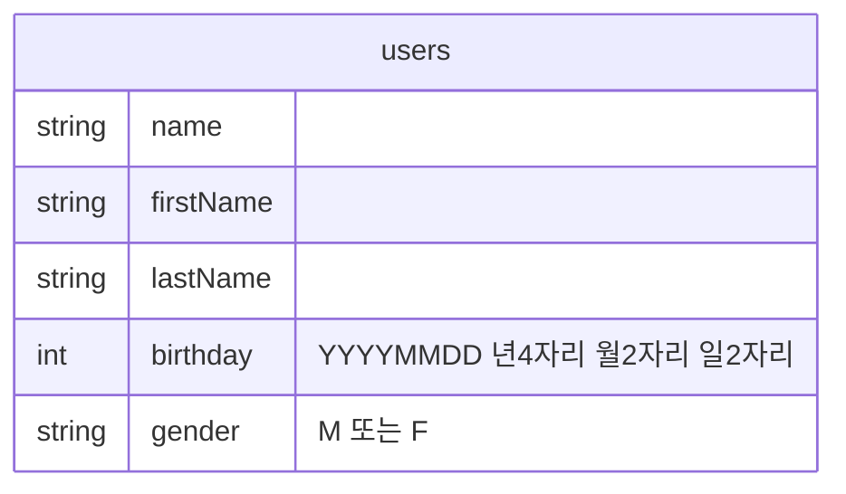
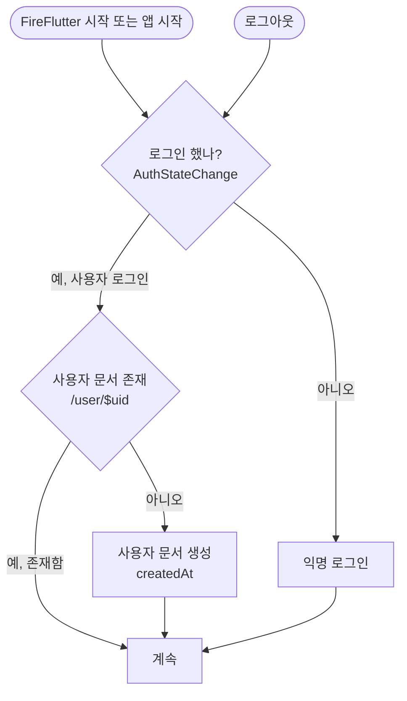

# FireFlutter v0.3

[English version](README.en.md)

# 개요

- 가장 간단한 코드를 작성하는 것을 목표로 한다. 코드가 복잡해지면 필연적으로 실패를 하게 된다.
- 파이어베이스 데이터베이스는 NoSQL, Flat Style 구조를 가진다.
  - 그래서, Entity Relationship 을 최소화한다.

# 데이터베이스

# 로직

## 연동

- `FireFlutter.service.init()` 을 앱 실행 후 가장 빠르게 호출한다.

## 사용자 로그인

- 사용자가 로그인을 하지 않은 경우(또는 로그아웃을 한 경우), 자동으로 `Anonymous` 로 로그인을 한다.
- 사용자가 로그인을 하는 경우, 또는 로그인이 되어져 있는 경우, 사용자 문서를 미리 읽어 (두번 읽지 않고) 재 활용을 해 왔는데, 심플한 코드를 위해서 미리 읽지 않는다.
  - 사용자의 정보 표현이 필요한 곳에서는 `MyDoc` 위젯을 사용한다.

# 코딩 가이드

- `User` 클래스는 사용자 정보를 관리한다.
- `Post` 클래스는 글 정보를 관리한다.
- `Comment` 클래스는 코멘트 정보를 관리한다.
