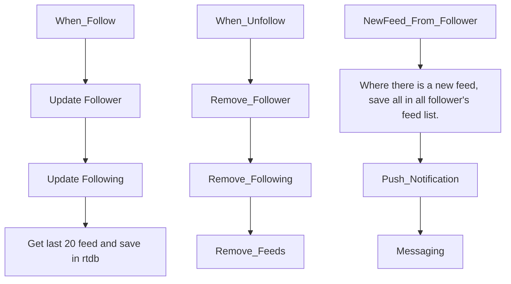
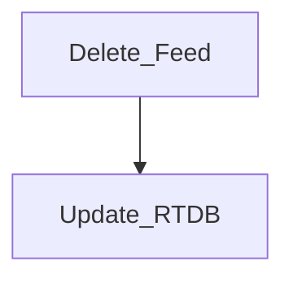
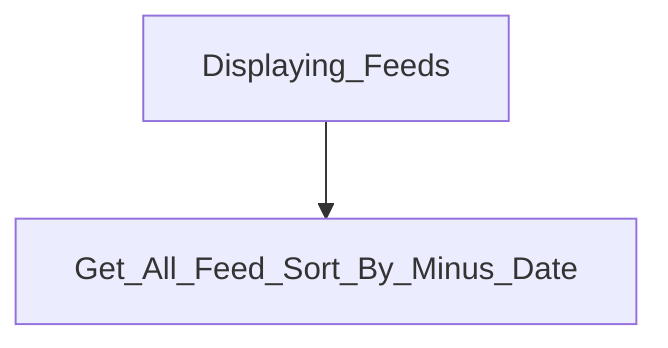

# FireFlutter


A free, open source, complete, rapid development package for creating Social apps, Chat apps, Community(Forum) apps, Shopping mall apps, and much more based on Firebase

- [FireFlutter](#fireflutter)
  - [Overview](#overview)
  - [Features](#features)
  - [Getting started](#getting-started)
- [Installation](#installation)
  - [Install the easy extension](#install-the-easy-extension)
  - [Install cloud functions](#install-cloud-functions)
  - [Security rules](#security-rules)
    - [Security rule for admin](#security-rule-for-admin)
  - [Cloud functions](#cloud-functions)
  - [Admin settings](#admin-settings)
  - [Setup the base code](#setup-the-base-code)
- [Usage](#usage)
  - [UserService](#userservice)
  - [ChatService](#chatservice)
    - [How to open 1:1 chat room](#how-to-open-11-chat-room)
    - [How to display chat room menu](#how-to-display-chat-room-menu)
    - [Customizing the chat header](#customizing-the-chat-header)
- [Widgets](#widgets)
  - [UserDoc](#userdoc)
  - [Avatar](#avatar)
  - [UserAvatar](#useravatar)
  - [UserProfileAvatar](#userprofileavatar)
  - [User List View](#user-list-view)
- [Chat Feature](#chat-feature)
  - [Welcome message](#welcome-message)
  - [No of new message](#no-of-new-message)
- [User](#user)
- [Upload](#upload)
  - [Photo upload](#photo-upload)
- [Push notifications](#push-notifications)
  - [Customizing source](#customizing-source)
- [Following and Follower](#following-and-follower)
  - [Feed listing logic](#feed-listing-logic)
  - [How to follow](#how-to-follow)
  - [How to unfollow](#how-to-unfollow)
- [Customization](#customization)
  - [Chat Customization](#chat-customization)
- [Translation](#translation)
- [Unit Testing](#unit-testing)
  - [Testing on Local Emulators and Firebase](#testing-on-local-emulators-and-firebase)
  - [Testing security rules](#testing-security-rules)
  - [Testing on real Firebase](#testing-on-real-firebase)
  - [Testing on Cloud Functions](#testing-on-cloud-functions)
- [Developer](#developer)
  - [Development Tips](#development-tips)
- [Contribution](#contribution)
  - [Install FireFlutter and Example Project](#install-fireflutter-and-example-project)
  - [Coding Guideline](#coding-guideline)
- [OLD README](#old-readme)
  - [TODO](#todo)
  - [Overview](#overview-1)
    - [Principle of Design](#principle-of-design)
    - [Chat Room Features](#chat-room-features)
  - [Environment](#environment)
  - [Basic Features](#basic-features)
  - [Example](#example)
  - [Installation](#installation-1)
  - [Setup](#setup)
    - [Firebase Setup](#firebase-setup)
      - [Firebase Users collection](#firebase-users-collection)
    - [Updating auth custom claims](#updating-auth-custom-claims)
    - [Disable user](#disable-user)
      - [Firestore Security Rules](#firestore-security-rules)
      - [Firebase Indexes](#firebase-indexes)
  - [Widgets](#widgets-1)
    - [Chat Room List](#chat-room-list)
    - [Create a chat room](#create-a-chat-room)
    - [How to display a chat room](#how-to-display-a-chat-room)
    - [Additional information](#additional-information)
    - [How to test \& UI work Chat room screen](#how-to-test--ui-work-chat-room-screen)
  - [Firebase](#firebase)
    - [Security Rules](#security-rules-1)
  - [Logic](#logic)
    - [Fields](#fields)
      - [Chat Room fields](#chat-room-fields)
      - [Chat Message fields](#chat-message-fields)
    - [Counting no of new messages](#counting-no-of-new-messages)
    - [Displaying chat rooms that has new message (unread messages)](#displaying-chat-rooms-that-has-new-message-unread-messages)
    - [1:1 Chat and Multi user chat](#11-chat-and-multi-user-chat)
  - [UI Customization](#ui-customization)
    - [Chat room list](#chat-room-list-1)
  - [Chat Room Menu](#chat-room-menu)
  - [Chat Room Settings](#chat-room-settings)
  - [Run the Security Rule Test](#run-the-security-rule-test)
  - [Run the Logic Test](#run-the-logic-test)
    - [Tests in Logic Test](#tests-in-logic-test)
- [Developers](#developers)
  - [How to add the easychat package as subtree into your project as the repo master](#how-to-add-the-easychat-package-as-subtree-into-your-project-as-the-repo-master)
  - [Deploy](#deploy)
  - [Tips](#tips)


## Overview

- We don't use `json_serializable` since the field should be dynamically added or edited. And the model class has not only the json serialized data, but also basic functionalities for the model.

## Features

- User management
- Chat
- Forum
- Push notification

## Getting started

If you want to build an app using FireFlutter, the best way is to copy codes from the example project.

# Installation


Please follow the instructions below to install the fireflutter.

## Install the easy extension

We built a firebase extension for the easy management of firebase. Install the following version.

[Install Easy Extension Beta (0.1.9-beta.1)](https://console.firebase.google.com/project/_/extensions/install?ref=jaehosong/easy-extension@0.1.9-beta.1)

This is a must firebase extension for the fireflutter to work properly.


## Install cloud functions

Since the firebase extension does not support sending push notification with node.js SDK, we just made it as cloud function.
To install,

```sh
cd firebase/cloud-functions/functions
npm i
firebase use add <project>
firebase run deploy
```


## Security rules

Security rules are under `/firebase/firestore/firestore.rules`.

Copy [the security rules of fireflutter](https://raw.githubusercontent.com/thruthesky/fireflutter/main/firebase/firestore/firestore.rules) and paste it in your firebase project. You may need to copy only the parts of the necessary security rules.


### Security rule for admin

You can add your uid (or other user's uid) to the `adminUIDs` variable in `isAdmin` function in the security rule. With this way, you don't have to pay extra money for validating the user is admin or not.

```dart
function isAdmin() {
  let adminUIDs = ['root', 'admin', 'CYKk5Q79AmYKQEzw8A95UyEahiz1'];
  return request.auth.uid in adminUIDs || request.auth.token.admin == true;
}
```


Once the admin is set, you can customize your security rules to restrict some docuemnts to write access from other users. By doing this way, you can add sub-admin(s) from client app (without editing the security rules on every time when you add subadmin)

For instance, you may write security rules like below and add the uids of sub-admin users. then, add a security rule function to check if the user is sub-admin.

```ts
  /setttings/sub-admins {
    allow read, write: if isAdmin();
  }
  function isSubAdmin() {
    ...
  }
```


## Cloud functions

Instead of building and managing cloud functions code, we choose to use it as firebase extension. The `easy-extension` has all the functions that fireflutter needs. See the [Install the easy extension](#install-the-easy-extension).


All cloud functions must go under `firebase/cloud-functions/functions` folder.


## Admin settings

See the [Security rules for admin](#security-rule-for-admin) chapter to set admin in the security rules. After this, you can set the `isAdmin` field to true on the admin's user document.


## Setup the base code

Fireflutter has many features and each feature has a signleton service class. You need to initialize each of the singleton on yor needs.


Since, fireflutter uses snackbars, it needs global key (or global build context). Put the global key into the `FireFlutterService.instance.init(context: ...)`. If you are not going to use the global key, you may not need to initialzie it like when you are only doing unit test.

For instance, if you are using go_route, you can pass the global build context like below.

```dart
UserService.instance.init(adminUid: 'xxx');

WidgetsBinding.instance.addPostFrameCallback((timeStamp) {
  FireFlutterService.instance.init(context: router.routerDelegate.navigatorKey.currentContext!);
}
```


By defualt, feed feature is disabled. To use feed features, add the following in app widget.


```dart
FeedService.instance.init(enable: true);
```


# Usage

## UserService

`UserService.instance.nullableUser` is null

- when the user didn't log in
- or when the user is logged in and has document, but the `UserService` has not read the user document, yet. In this case it simply needs to wait sometime.

`UserService.instance.nullableUser.exists` is false if the user has logged in but no document. In this case, the `documentNotExistBuilder` of `UserDoc` will be called.

So, the lifecyle will be the following when the app users `UserDoc`.

- `UserService.instance.nullableUser` will be null on app boot
- `UserService.instance.nullableUser` will have an instance of `User`
  - If the user document does not exists, `exists` will be `false` causing `documentNotExistsBuilder` to be called.
  - If the user document exsist, then it will have right data and `builder` will be called.

Right way of getting a user document.

```dart
UserService.instance.get(UserService.instance.uid).then((user) => ...);
```

The `UserService.instance.user` or `UserService.instance.docuemntChanges` may be null when the user document is being loaded on app boot. So, the better way to get the user's document for sure is to use `UserService.instance.get`

## ChatService

### How to open 1:1 chat room

Call the `showChatRoom` method anywhere with user model.

```dart
ChatService.instance.showChatRoom(context: context, user: user);
```

### How to display chat room menu

By default, it has a full screen dialog with default buttons. Since all apps have difference features and design, you will need to customize it or rebuild it. But see the code inside and copy and paste them into your project.

How to show chat room dialog.

```dart
showGeneralDialog(
  context: context,
  pageBuilder: (context, _, __) => Scaffold(
    appBar: AppBar(
      title: const Text('Invite User'),
    ),
    body: ChatRoomUserInviteDialog(room: room),
  ),
);
```


### Customizing the chat header

You can build your own chat header like below.

```dart
ChatService.instance.customize.chatRoomAppBarBuilder = (room) => MomCafeChatRoomAppBar(room: room);
```

# Widgets


* The widgets in fireflutter can be a small piece of UI representation or it can be a full screen dialog.

* The file names and the class names of the widgets must match.
* The user widgets are inside `widgets/user` and the file name is in the form of `user.xxxx.dart` or `user.xxxx.dialog.dart`. And it goes the same to chat and forum.

## UserDoc

To display user's profile photo, use like below.
See the comment for the details.

```dart
UserDoc(
  builder: (user) => UserProfileAvatar(
    user: user,
    size: 38,
    shadowBlurRadius: 0.0,
    onTap: () => context.push(ProfileScreen.routeName),
    defaultIcon: const FaIcon(FontAwesomeIcons.lightCircleUser, size: 38),
    backgroundColor: Theme.of(context).colorScheme.inversePrimary,
  ),
  documentNotExistBuilder: () {
    // Create user document if not exists.
    UserService.instance.create();
    return const SizedBox.shrink();
  },
),
```

## Avatar

This is a similiar widget of the `CircleAvatar` in Material UI.

```dart
Avatar(url: 'https://picsum.photos/200/300'),
```

## UserAvatar

To display user's profile photo, use `UserAvatar`.
Not that, `UserAvatar` does not update the user photo in realtime. So, you may need to give a key when you want it to dsiplay new photo url.

```dart
UserAvatar(
  user: user,
  size: 120,
),
```

## UserProfileAvatar

To let user update or delete the profile photo, use like below.

```dart
UserProfileAvatar(
  user: user,
  size: 120,
  upload: true,
  delete: true,
),
```

## User List View

Use this widget to list users. By default, it will list all users. This widget can also
be used to search users by filtering a field with a string value.

This widget is a list view that has a `ListTile` in each item. So, it supports the properties of `ListView` and `ListTile` at the same time.

```dart
UserListView(
  searchText: 'nameValue',
  field: 'name',
),
```

Example of complete code for displaying the `UserListView` in a dialog with search box

```dart
onPressed() async {
  final user = await showGeneralDialog<User>(
    context: context,
    pageBuilder: (context, _, __) {
      TextEditingController search = TextEditingController();
      return StatefulBuilder(builder: (context, setState) {
        return Scaffold(
          appBar: AppBar(
            backgroundColor: Theme.of(context).colorScheme.inversePrimary,
            title: const Text('Find friends'),
          ),
          body: Container(
            padding: const EdgeInsets.all(20),
            child: Column(
              children: [
                TextField(
                  controller: search,
                  decoration: const InputDecoration(
                    border: OutlineInputBorder(),
                    labelText: 'Search',
                  ),
                  onSubmitted: (value) => setState(() => search.text = value),
                ),
                Expanded(
                  child: UserListView(
                    key: ValueKey(search.text),
                    searchText: search.text,
                    field: 'name',
                    avatarBuilder: (user) => const Text('Photo'),
                    titleBuilder: (user) => Text(user?.uid ?? ''),
                    subtitleBuilder: (user) => Text(user?.phoneNumber ?? ''),
                    trailingBuilder: (user) => const Icon(Icons.add),
                    onTap: (user) => context.pop(user),
                  ),
                ),
              ],
            ),
          ),
        );
      });
    },
  );

```


# Chat Feature


## Welcome message

To send a welcome chat message to a user who just registered, use `UserService.instance.sendWelcomeMessage`. See details on the comments of the source.

## No of new message

We save the no of new messages of each users in RTDB. If we save the no of new messages of all users of the room in the chat room document like `{ noOfNewMessages: { uid-A: 1, uid-B 2, ... }}`, there will be performance issue and it will cost more. The problem is the chat room must be listened as a stream for realtime update. And if a user chats there are other users who read. Everytime a user reads a messgae, the chat room docuemnt will be fetched for every user with no reason. This is jus tan extra cost. So, we put the number of new messages under `/chats/{roomId}/noOfNewMessages/{uid}` in RTDB.


# User

`idVerifiedCode` is the code of user's authentication id code. This is used to save user's id code when the user uploaded his id card like passport and the AI (Firebase AI Extension) detect user's information and the verification succeed, the file path is being hsave in `idVerificationCoce`. You may use it on your own purpose.

`complete` is a boolean field to indicate that the user completed updating his profile information.

`verified` is a boolean field to indicate that the user's identification has fully verified by the system. Note that, this is not secured by the rules as of now. Meaning, user can edit it by himself.


# Upload

## Photo upload

You can upload photo like below. It will display a dialog to choose photo from photo gallery or camera.

```dart
final url = await StorageService.instance.upload(context: context);
```

The code below displays a button and do the file upload process.

```dart
IconButton(
  onPressed: () async {
    final url = await StorageService.instance.upload(
      context: context,
      progress: (p) => setState(() => progress = p),
      complete: () => setState(() => progress = null),
    );
    print('url: $url');
    if (url != null && mounted) {
      setState(() {
        urls.add(url);
      });
    }
  },
  icon: const Icon(
    Icons.camera_alt,
    size: 36,
  ),
),
```

It has options like displaying a progressive percentage.


# Push notifications


```dart
    // init here
    MessagingService.instance.init(
      // while the app is close and notification arrive you can use this to do small work
      // example are changing the badge count or informing backend.
      onBackgroundMessage: onTerminatedMessage,

      ///
      onForegroundMessage: (RemoteMessage message) {
        onForegroundMessage(message);
      },
      onMessageOpenedFromTerminated: (message) {
        // this will triggered when the notification on tray was tap while the app is closed
        // if you change screen right after the app is open it display only white screen.
        WidgetsBinding.instance.addPostFrameCallback((duration) {
          onTapMessage(message);
        });
      },
      // this will triggered when the notification on tray was tap while the app is open but in background state.
      onMessageOpenedFromBackground: (message) {
        onTapMessage(message);
      },
      onNotificationPermissionDenied: () {
        // print('onNotificationPermissionDenied()');
      },
      onNotificationPermissionNotDetermined: () {
        // print('onNotificationPermissionNotDetermined()');
      },
    );
```

## Customizing source


You can limit the uploaded sources. You can choose camera, gallery, or files like below.

```dart
ChatService.instance.init(
  uploadFromCamera: true,
  uploadFromGallery: true,
  uploadFromFile: false,
);
PostService.instance.init(
  uploadFromCamera: false,
  uploadFromGallery: true,
  uploadFromFile: false,
);
CommentService.instance.init(
  uploadFromCamera: true,
  uploadFromGallery: false,
  uploadFromFile: false,
);
```


# Following and Follower


- When A follows B,
  - B's uid will be added into `followings` field of A's document.
  - And A's uid will be added into `followers` field in B's document.
  - Get the last 20 posts of B and save title, content, photo, createAt into `/feeds/{uid}` in RTDB.
  - See the security rules for this logic.

- When A unfollow B, all the relative data will be removed.
  - `followings`, `followers`, RTDB.


- When A open's his wall(it could be home, profile or any screen), A can display the posts who he follows with `FeedListView` widget.
- To display the followers use `FollowerListView`.
- To display the users who you follow, use `FollowingListView`.

- A feed is a post that user can create on the forum in whatever category.


## Feed listing logic

- Terms
  - `follow` is an action that I am following other user.
  - `followed` is an action that I am being followed by other user.
  - `followers` is a field that contains a list of uid that are follow me. For instance, C and D follow me. then `followers` will contain `[C, D]`.
  - `folowings` is a field that contains a list of uid that I am the one who follow other user. For instance, I follow E and F, then `followings` will contain `[E, F]`

- Since the `in` filter is limited into 30 element, we cannot use it to query the posts of `followings`.









## How to follow

Use `FeedService.instance.follow`. This will produce a permission error if you are going to follow a user that you are already following.


## How to unfollow

Use `FeedService.instance.unfollow`. This will produce a permission error if you try to unfollow a user that you are not following.

# Customization

`fireflutter` supports full customization from the i18n to the complete UI.


## Chat Customization

The fireflutter gives full customization of the chat feature. It has a lot of widgets and texts to customize and they are nested deep inside the widget layers. So, the fireflutter lets developers to register the builder functions to display(customize) the widgets that are being used in deep place of the chat feature.

Registering the build functions do not cause any performance issues since it only registers the build functions at app booting time. It does not build any widgets while registering.

```dart
ChatService.instance.customize.chatRoomAppBarBuilder = (room) => MomCafeChatRoomAppBar(room: room);
```


# Translation

I feel like the standard i18n feature is a bit heavy and searched for other i18n packages. And I decided to write a simple i18n code for fireflutter.

The i18n code is in `lib/i18n/t.dart`.

By default, it supports English and you can change it to any language.

Here is an example of updating the translation.

```dart
tr.user.loginFirst = '로그인을 해 주세요.';
```


# Unit Testing

## Testing on Local Emulators and Firebase

- We do unit testing on both of local emulator and on real Firebase. It depends on how the test structure is formed.


## Testing security rules

Run the firebase emulators like the followings. Note that you will need to install and setup emulators if you didn't.

```sh
cd firebase/firestore
firebase emulators:start
```

Then, run all the test like below.
```sh
npm test
```

To run group of tests, specify folder name.

```sh
npm run mocha tests/rule-functions
npm run mocha tests/posts
```


To run a single test file, specify file name.

```sh
npm run mocha tests/posts/create.spec.js
npm run mocha tests/posts/likes.spec.js
```


## Testing on real Firebase

- Test files are under `functions/tests`. This test files work with real Firebase. So, you may need provide a Firebase for test use.

  - You can run the emulator on the same folder where `functions/firebase.json` resides, and run the tests on the same folder.

- To run the sample test,

  - `npm run test:index`

- To run all the tests

  - `npm run test`

- To run a test by specifying a test script,
  - `npm run mocha -- tests/**/*.ts`
  - `npm run mocha -- tests/update_custom_claims/get_set.spec.ts`
  - `npm run mocha -- tests/update_custom_claims/update.spec.ts`


## Testing on Cloud Functions

All of the cloud functions are tested directly on remote firebase (not in emulator). So, you need to save the account service in `firebase/service-account.json`. The service account file is listed in .gitignore. So, It won't be added into git.

To run all the test,
```sh
cd firebase/functions
npm i
run test
```

To run a single test,

```sh
npm run mocha **/save-token*
npm run mocha **/save-token.test.ts
```


# Developer

## Development Tips

Most often, you would click, and click, and click over, and over again, and again to see what you have changed on the UI. Then, you change the UI again. And you would click, and click over again, and again, ...
Yes, this is the reality.

To avoid this, you can display the UI part immediately after hot-restart (with keyboard shortcut) like below. This is merely a sample code. You can test any part of the app like below.


Below is an example of openning a chat room

```dart
ChatService.instance.showChatRoom(
  context: context,
  room: await Room.get('hQnhAosriiewigr4vWFx'),
);
```

Below is an example of openning a group chat room menu dialog.
I copied the `Room` properties manually from the Firestore document and I edited some of the values of the properties for test purpose. You may code a line to get the real room model data.

```dart
class _HomeScreenState extends State<HomeScreen> {
  @override
  void initState() {
    super.initState();

    Timer(const Duration(milliseconds: 200), () {
      ChatService.instance.openChatRoomMenuDialog(
        context: context,
        room: Room(
          id: 'DHZWDyeuAlgmKxFxbMbF',
          name: 'Here we are in Manila. Lets celebrate this beautiful day.',
          group: true,
          open: true,
          master: 'ojxsBLMSS6UIegzixHyP4zWaVm13',
          users: [
            '15ZXRtt5I2Vr2xo5SJBjAVWaZ0V2',
            '23TE0SWd8Mejv0Icv6vhSDRHe183',
            'JAekM4AyPTW1fD9NCwqyLuBCTrI3',
            'X5ps2UhgbbfUd7UH1JBoUedBzim2',
            'lyCxEC0oGtUcGi0KKMAs8Y7ihSl2',
            'ojxsBLMSS6UIegzixHyP4zWaVm13',
            'aaa', // not existing user
            't1fAVTeN5oMshEPYn9VvB8TuZUy2',
            'bbb', // not existing user
            'ccc', // not existing user
            'ddd', // not existing user
            'eee', // not existing user
          ],
          moderators: ['lyCxEC0oGtUcGi0KKMAs8Y7ihSl2', '15ZXRtt5I2Vr2xo5SJBjAVWaZ0V2'],
          blockedUsers: [],
          noOfNewMessages: {},
          maximumNoOfUsers: 3,
          rename: {
            FirebaseAuth.instance.currentUser!.uid: 'I renamed this chat room',
          },
          createdAt: Timestamp.now(),
        ),
      );
```


Below is  an example of opening a single chat room. I got the room data by calling `print` on a chat room.

```dart
ChatService.instance.showChatRoom(
  context: context,
  room: Room(
    id: '23TE0SWd8Mejv0Icv6vhSDRHe183-ojxsBLMSS6UIegzixHyP4zWaVm13',
    name: '',
    group: false,
    open: false,
    master: '23TE0SWd8Mejv0Icv6vhSDRHe183',
    users: ['23TE0SWd8Mejv0Icv6vhSDRHe183', 'ojxsBLMSS6UIegzixHyP4zWaVm13'],
    rename: {},
    moderators: [],
    maximumNoOfUsers: 2,
    createdAt: Timestamp.now(),
    blockedUsers: [],
  ),
);
```


Below is to show post view screen.

```dart
/// Example 1
Post.get('Uc2TKInQ9oBJeKtSJpBq').then((p) => PostService.instance.showPostViewDialog(context, p));

/// Example 2
WidgetsBinding.instance.addPostFrameCallback((timeStamp) async {
  PostService.instance.showPostViewDialog(context, await Post.get('Wqdje1wU1IDVs7Uus936'));
});
```

Below is to show post edit dialog.

```dart
Post.get('Uc2TKInQ9oBJeKtSJpBq').then((p) => PostService.instance.showPostEditDialog(context, post: p));
```


The code below shows how to open a post create dialog.

```dart
PostService.instance.showCreateDialog(
  context,
  categoryId: 'buyandsell',
  success: (p) => print(p),
);
```


The code below shows how to open a 1:1 chat room and send a message to the other user.

```dart
UserService.instance.get(UserService.instance.adminUid).then(
  (user) async {
    ChatService.instance.showChatRoom(context: context, user: user);
    ChatService.instance.sendMessage(
      room: await ChatService.instance.getSingleChatRoom(UserService.instance.adminUid),
      text: "https://naver.com",
    );
  },
);
```


The code below shows how to open a comment edit bottom sheet. Use this for commet edit bottom sheet UI.

```dart
PostService.instance.showPostViewDialog(context, await Post.get('PoxnpxpcC2lnYv0jqI4f'));
if (mounted) {
  CommentService.instance.showCommentEditBottomSheet(
    context,
    comment: await Comment.get('bvCJk4RFK79yexAKfAYs'),
  );
}
```


# Contribution

Fork the fireflutter and create your own branch. Then update code and push, then pull request.

## Install FireFlutter and Example Project


```sh
git clone https://github.com/thruthesky/fireflutter
cd fireflutter
mkdir apps
cd apps
git clone https://github.com/thruthesky/example
cd example
flutter run
```

## Coding Guideline

fireflutter uses sigular form in its file name and variable name, class name. For instance, it alwasy `user` over `users` unless there is good reason.


# OLD README

- Below are the old read files.

## TODO

- See the Principle.
- Login is required to use this app. Meaning, this package does not provide login relational feature. the parent app must provide login and login is reuqired for using this package.
- Create chat room.
- Updating user's display name and photo url in chat room collection. Not indivisual chat message.

## Overview

### Principle of Design

- This firebase extension helps to manage your firebase.

- When a document is created under the `easy-commands` collection,

  - The firebase background function will execute the comamnd specified in `{ command: ... }`.

- Easychat provides logic as much as possible. This means, the app must provide UI and hook the user event with the easychat logic.

  - In some case, easychat must provide ui like displaying the list of chat friend list or chat room and message list. But still easychaht provides a way to customise everything.

- Easychat also provide sample UI. So, developer can see the code, copy and customise it.

- Easychat throws exceptions when there are problems. It is the app's responsibility to catch and handle them.
- For sample UI widgets, it provides `sucess` and `error` handler.

### Chat Room Features

- The one who creats the chat room is the master manager of the chat.
- The master manager can set moderators.
- Moderators can

  - kick out chat members.
  - block or unblock chat members not to join again.
  - set password so other member may not join.

- `OpenChat`

  - A group chat which is searchable.
  - Anybody search chat room and join.
  - Members of the group chat can invite other users.

- `PrivateChat`
  - A group chat which is not searchable.
  - Only Master and Moderators can invite users.

## Environment

- Firestore

## Basic Features

- Chat room list
- 1:1 chat room & multi chat
- File upload api

## Example

## Installation

- The example is in [easychat_example](https://github.com/thruthesky/easychat_example) repository. Add it in `apps` folder and test it.

## Setup

- [Beta (0.1.4-beta.0)](https://console.firebase.google.com/project/_/extensions/install?ref=jaehosong/easy-extension@0.1.4-beta.0)
- [Beta (0.1.0-beta.0)](https://console.firebase.google.com/project/_/extensions/install?ref=jaehosong/easy-extension@0.1.0-beta.0)
- [Alpha (0.0.21-alpha.1)](https://console.firebase.google.com/u/0/project/_/extensions/install?ref=jaehosong%2Feasy-extension@0.0.22-alpha.0)

### Firebase Setup

- Easychat package uses the same connection on your application. You can simply initialize firebase connection inside your application.

- The firestore structure for easychat is fixed. If you want to change, you may need to change the security rules and the source code of the package.
- `/easychat` is the root collection for all chat. The document inside this collection has chat room information.
- `/eachchat/{documentId}/messages` is the collection for storing all the chat messages.

#### Firebase Users collection

- You can initialize the easychat to use your user list collection and It must be readable.
  - Easychat needs displayName and photoUrl in the collection.
  - Set the user's information like below.

```dart
EasyChat.instance.initialize(usersCollection: 'users', displayNameField: 'displayName', photoUrlField: 'photoUrl')
```

- listen `eventarc` and update it into a document. For instance, after image processing, listen the event and update it on a document.

### Updating auth custom claims

- Required properties

  - `{ command: 'update_custom_claims' }` - the command.
  - `{ uid: 'xxx' }` - the user's uid that the claims will be applied to.
  - `{ claims: { key: value, xxx: xxx, ... } }` - other keys and values for the claims.

- example of document creation for update_custom claims


- Response
  - `{ config: ... }` - the configuration of the extension
  - `{ response: { status: 'success' } }` - success respones
  - `{ response: { timestamp: xxxx } }` - the time that the executino had finished.
  - `{ response: { claims: { ..., ... } } }` - the claims that the user currently has. Not the claims that were requested for updating.


- `SYNC_CUSTOM_CLAIMS` option only works with `update_custom_claims` command.
  - When it is set to `yes`, the claims of the user will be set to user's document.
  - By knowing user's custom claims,
    - the app can know that if the user is admin or not.
      - If the user is admin, then the app can show admin menu to the user.
    - Security rules can work better.

### Disable user

- Disabling a user means that they can't sign in anymore, nor refresh their ID token. In practice this means that within an hour of disabling the user they can no longer have a request.auth.uid in your security rules.

  - If you wish to block the user immediately, I recommend to run another command. Running `update_custom_claims` comand with `{ disabled: true }` and you can add it on security rules.
  - Additionally, you can enable `set enable field on user document` to yes. This will add `disabled` field on user documents and you can search(list) users who are disabled.

- `SYNC_USER_DISABLED_FIELD` option only works with `disable_user` command.

  - When it is set to yes, the `disabled` field with `true` will be set to user document.
  - Use this to know if the user is disabled.

- Request

```ts
{
  command: 'delete_user',
  uid: '--user-uid--',
}
```

- Warning! Once a user changes his displayName and photoUrl, `EasyChat.instance.updateUser()` must be called to update user information in easychat.

#### Firestore Security Rules

- Copy the following security rules and paste it into your Firebase project.

```json
 ... security rules here ...
```

#### Firebase Indexes

| Collection ID | Fields Indexd               |
| ------------- | --------------------------- |
| easychat      | users lastMessage.createdAt |

## Widgets

- In this chapter, the usage of the widgets is explained.

### Chat Room List

- The beginning point would be chat room list screen.

  - On the chat room list screen, you can display chat room create icon and the login user's chat room list.

- Follow the setup first.

- You can display chat room list like below

```dart
final ChatRoomListViewController controller = ChatRoomListViewController();
ChatRoomListView(
  controller: controller,
),
```


You can customsize the chat room item in the list like below. You can replace the `ChatRoomListTile` or you can customize the onTap behavior.

```dart
ChatRoomListView(
  singleChatOnly: true,
  controller: controller,
  itemBuilder: (context, room) => ChatRoomListTile(
    room: room,
    onTap: () => controller.showChatRoom(context: context, room: room),
  ),
)
```


### Create a chat room

- To create a chat room, add a button and display `ChatRoomCreate` widget. You may copy the code from `ChatRoomCreate` and apply your own design.

```dart
class _ChatRoomListreenState extends State<ChatRoomListSreen> {
  @override
  Widget build(BuildContext context) {
    return Scaffold(
      appBar: AppBar(
        title: const Text('Easy Chat Room List'),
        actions: [
          IconButton(
            onPressed: () async {
              showDialog(
                context: context,
                builder: (_) => ChatRoomCreate(
                  success: (room) {
                    Navigator.of(context).pop();
                    if (context.mounted) {
                      controller.showChatRoom(context: context, room: room);
                    }
                  },
                  cancel: () => Navigator.of(context).pop(),
                  error: () => const ScaffoldMessenger(child: Text('Error creating chat room')),
                ),
              );
            },
            icon: const Icon(Icons.add),
          ),
        ],
      ),
```

- You need to create only one screen to use the easychat.

```dart
Scafolld(
  appBar: AppBar(
    title:
  )
)
```

### How to display a chat room

- In the chat room, there should be a header, a message list view as a body, and message input box.
- To display the chat room, you need to have a chat room model.
  - To have a chat room model, you need to create a chat room (probably a group chat).
  - Then, you will get it on the app by accessing the database or you may compose it using `ChatRoomModel.fromMap()`.
  - Then, pass the chat room model into the chat room (or you can compose a chat room manually with the chat room model.)

### Additional information

- Please create issues.

### How to test & UI work Chat room screen

```dart

    Timer.run(() {
      // Navigator.of(context).push(MaterialPageRoute(builder: (_) => const ChatScreen()));

// How to test a chat room screen:
      Navigator.of(context).push(
        MaterialPageRoute(
          /// Open the chat room screen with a chat room for the UI work and testing.
          builder: (_) => ExampleChatRoomScreen(
            /// Get the chat room from the firestore and pass it to the screen for the test.
            room: ChatRoomModel.fromMap(
              id: 'mFpHRSZLCemCfC2B9Y3B',
              map: {
                'name': 'Test Chat Room',
              },
            ),
          ),
        ),
      );
    });
```

## Firebase

### Security Rules

- Run firestore emulator like below and test the security rules.

```sh
% firebase emulators:start --only firestore
```

## Logic

### Fields

#### Chat Room fields

- `master: [string]` is the master. root of the chat room.
- `moderators: Array[uid]` is the moderators.
- `group: [boolean]` - if true, it's group chat. otherwise it's 1:1 chat
- `open: [boolean]` - if true, any one in the room can invite and anyone can jogin (except if it's 1:1 chat). If it's false, no one can join except the invitation of master and moderators.
- `createdAt: [timestamp|date]` is the time that the chat room created.
- `users: Array[uid]` is the number of users.
- `noOfNewMessages: Map<string, number>` - This contains the uid of the chat room users as key and the number of new messages as value.
- `lastMessage: Map` is the last message in the room.
  - `createdAt: [timestamp|date]` is the time that the last message was sent.
  - `uid: [string]` is the sender Uid
  - `text: [string]` is the text in the message
- `maximumNoOfUsers: [int]` is the maximum no of users in the group.

#### Chat Message fields

- `text` is the text message [Optional] - Optional, meaning, a message can be sent without the text.
- `createdAt` is the time that the message was sent.
- `uid` is the sender Uid
- `imageUrl [String]` is the image's URL added to the message. [Optional]
- `fileUrl [String]` is the file's URL added to the message. [Optional]
- `fileName` is the file name of the file from `fileUrl`. [Optional]

### Counting no of new messages

- We don't seprate the storage of the no of new message from the chat room document. We have thought about it and finalized that that is not worth. It does not have any money and the logic isn't any simple.
- noOfNewMessages will have the uid and no. like `{uid-a: 5, uid-b: 0, uid-c: 2}`
- When somebody chats, increase the no of new messages except the sender.
- Wehn somebody receives a message in a chat room, make his no of new message to 0.
- When somebody enters the chat room, make his no of new message to 0.

### Displaying chat rooms that has new message (unread messages)

- Get whole list of chat room.
- Filter chat rooms that has 0 of noOfNewmessage of my uid.

### 1:1 Chat and Multi user chat

- 1:1 chat room id must be consisted with `uid-uid` pattern in alphabetically sorted.

- When the login user taps on a chat room, it is considered that the user wants to enter the chat room. It may be a 1:1 chat or group chat.
  - In this case, the app will deliver `ChatRoomModel` as a prameter to chat room list screen and chat room list screen will open the chat room.
- When the login user taps on a user, it means, the login user want to chat with the user. It will be only 1:1 chat.
  - Int his case, the app will deliver `UserModel` as a parameter to chat room list screen and chat room list screen will open the chat room.
  - When the login user taps on a user, the app must search if the 1:1 chat room exsits.
    - If yes, enter the chat room,
    - If not, create 1:1 chat room and put the two as a member of the chat room, and enter.
- When one of user in 1:1 chat invites another user, new group chat room will be created and the three users will be the starting members of the chat room.

  - And the new chat room is a group chat room and more members would invited (without creating another chat room).

- Any user in the chat room can invite other user unless it is password-locked.
- Onlt the master can update the password.
<!-- TODO for confirmation about password -->
- The `inviting` means, the invitor will add the `invitee`'s uid into `users` field.

  - It is same as `joining`. If the user who wants to join the room, he will simply add his uid into `users` field. That's called `joining`.

- Any one can join the chat room if `/easychat/{id}/{ open: true }`.

  - 1:1 chat room must not have `{open: false}`.

- If a chat room has `{open: false}`, no body can join the room except the invitation of master and moderators.

- group chat room must have `{group: true, open: [boolean]}`. This is for searching purpose in Firestore.
  - For 1:1 chat room, it must be `{group: false, open: false}`. This is for searching purpose in Firestore.

## UI Customization

UI can be customized

### Chat room list

- To list chat rooms, use the code below.

```dart
ChatRoomListView(
  controller: controller,
  itemBuilder: (context, room) {
    return ListTile(
        leading: const Icon(Icons.chat),
        title: ChatRoomListTileName(
          room: room,
          style: const TextStyle(color: Colors.blue),
        ),
        trailing: const Icon(Icons.chevron_right),
        onTap: () {
          controller.showChatRoom(context: context, room: room);
        });
  },
)
```

## Chat Room Menu

The chat room menu can be accessed by the Chat Room Menu Button. This will open the Chat Room Menu Screen.

```dart
ChatRoomMenuButton(
  room: chatRoomModel,
  onUpdateRoomSetting: (updatedRoom) {
    debugPrint("If a setting was updated. Setting: ${updatedRoom.toString()}");
  },
),
```

The Chat Room Menu consists the following:

- `Invite User` This button opens a List View of users that can be invited to the group chat. To use Invite User Button for List View, follow the code:

```dart
InviteUserButton(
  room: chatRoomModel,
  onInvite: (invitedUserUid) {
    debugPrint("You have just invited a user with a uid of $invitedUserUid");
  },
),
```

To programatically, invite a user, follow these codes:

```dart
updatedRoom = await EasyChat.instance.inviteUser(room: chatRoomModel, userUid: user.uid);
```

- `Settings` This can open the chat room settings. To use the button that opens the settings menu:

```dart
ChatSettingsButton(
  room: chatRoomModel,
  onUpdateRoomSetting: (updatedRoom) {
    debugPrint("Something was updated in the room. Setting ${updatedRoom.toString()}");
  },
),
```

See [Chat Room Settings](#chat-room-settings) for more details

- `Members` This is a List View of the members of the group chat. The user can be marked as [Master], [Moderator] and/or [Blocked]. Tapping the user will open a Dialog that may show options for Setting as Moderator, or Blocking on the group.

## Chat Room Settings

- `Open Chat Room` This setting determines if the group chat is open or private. Open means anybody can join and invite. Private means only the master or moderators can invite. See the code below to use the Default List Tile.

```dart
ChatRoomOpenSettingListTile(
  room: chatRoomModel,
  onToggleOpen: (updatedRoom) {
    debugPrint('Updated Room Open Setting. Setting: ${updatedRoom.open}');
  },
),
```

To programatically update the setting, follow the code below. It will return the room with updated setting.

```dart
updatedRoom = await EasyChat.instance.updateRoomSetting(
  room: chatRoomModel,
  setting: 'open',
  value: updatedBoolValue,
);
```

- `Maximum Number of User` This number sets the limitation for the number of users in the chat room. If the current number of users is equal or more than this setting, it will not proceed on adding the user.

```dart
ChatRoomMaximumUsersSettingListTile(
  room: chatRoomModel,
  onUpdateMaximumNoOfUsers: (updatedRoom) {
    debugPrint('Updated Maximum number of Users Setting. Setting: ${updatedRoom.maximumNoOfUsers}');
  },
),
```

To programatically update the setting, follow the code below. It will return the room with updated setting.

```dart
updatedRoom = await EasyChat.instance.updateRoomSetting(
  room: chatRoomModel,
  setting: 'maximumNoOfUsers',
  value: updatedIntValue
);
```

- `Default Chat Room Name` The master can use this setting to set the default name of the Group Chat.

```dart
ChatRoomDefaultRoomNameSettingListTile(
  room: _roomState!,
  onUpdateChatRoomName: (updatedRoom) {
    widget.onUpdateRoomSetting?.call(updatedRoom);
  },
),
```

To programatically update the default chat room name, follow the code below. It will return the room with updated setting.

```dart
updatedRoom = await EasyChat.instance.updateRoomSetting(
  room: chatRoomModel,
  setting: 'name',
  value: updatedName
);
```

## Run the Security Rule Test

- To run all the tests

  - `% npm run test`

- To run a single test file, run like below.
  - `npm run mocha -- tests/xxxxx.spec.js`by dev1

## Run the Logic Test

- We don't do the `unit test`, `widget test`, or `integration test`. Instead, we do `logic test` that is developed by ourselves for our test purpose.
  - You can see the test in `TestScreen`.

### Tests in Logic Test

The following are the available logic tests that can be used.

- Creating Group Chat Room
- Chat Room's Number of New Messages
- Maximum Nunber of Users Setting
- Creating Single Chat Room
- Inviting User into Single Chat
- Inviting User into Group Chat
- Changing the Default Chat Room Name
- Renaming Chat Room Own Side
- Updating Chat Room Password
  - Master can update the password
  - Moderator can update the password
  - Non-admin members should not be able to update the password
  - Password can be cleared

<!-- TODO: Insert Details per test -->

# Developers

## How to add the easychat package as subtree into your project as the repo master

- Note only the master need to as it as subtree.

- Add `easychat` as `git subtree` like below. Note that this is for package developers only.
  - Note that, the `easychat` may have its own `subtree` which means, it may have nested subtrees.

```sh
% flutter create [projectName]
% cd [projectName]
% flutter run
% git remote add origin [https://github.com/your-account/project-name]
% git add . && git commit -m "..."
% git push -f -u origin main
% git remote add easychat https://github.com/thruthesky/easychat
% git subtree add --prefix lib/easychat easychat main
% flutterfire configure
% flutter pub add firebase_core
% flutter pub add firebase_auth
% flutter pub add firebase_storage
% flutter pub add firebase_ui_firestore
% flutter pub add cloud_firestore
% ... add more packages ....
```

- Add the `easychat` package like below.

```yaml
easychat:
  path: lib/easychat
```

- Initialize firebase like below.

```dart
void main() async {
  WidgetsFlutterBinding.ensureInitialized();
  await Firebase.initializeApp(
    options: DefaultFirebaseOptions.currentPlatform,
  );
  runApp(const MyApp());
}
```

- Enable the [easychat security rules](https://github.com/thruthesky/easychat/blob/main/easychat-security-rules/firestore.rules)

- Use the `TestUi` like below.

```dart
class _MyHomePageState extends State<MyHomePage> {
  @override
  Widget build(BuildContext context) {
    return Scaffold(
      appBar: AppBar(
        backgroundColor: Theme.of(context).colorScheme.inversePrimary,
        title: Text(widget.title),
      ),
      body: TestUi(),
    );
  }
}
```

- For wrong command, error like below will happen

```ts
{
  command: 'wrong-command',
  response: {
    code: 'execution/command-not-found',
    message: 'command execution error',
    status: 'error',
    timestamp: Timestamp { _seconds: 1690097695, _nanoseconds: 194000000 }
  }
}
```

- Take note that errors may occur when the multiple execution of testAll are concurrently running.

## Deploy

- To deploy to functions, run the command below.
  - `npm run deploy`
## Tips

- If you want, you can add `timestamp` field for listing.
