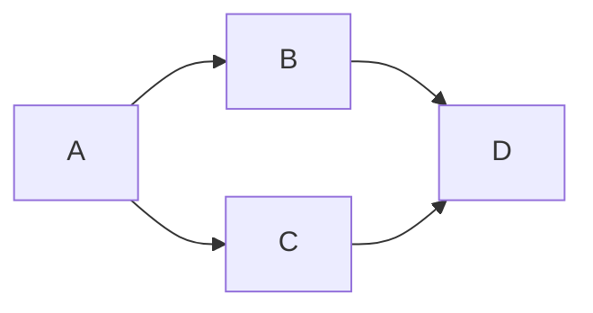

# FireFlutter v0.3

[English version](README.en.md)

# 개요

- `User` 클래스는 사용자 정보를 관리한다.
- `Post` 클래스는 글 정보를 관리한다.
- `Comment` 클래스는 코멘트 정보를 관리한다.

# 모델

```mermaid
graph LR;
   A-->B;
   A-->C;
   B-->D;
   C-->D;
```
