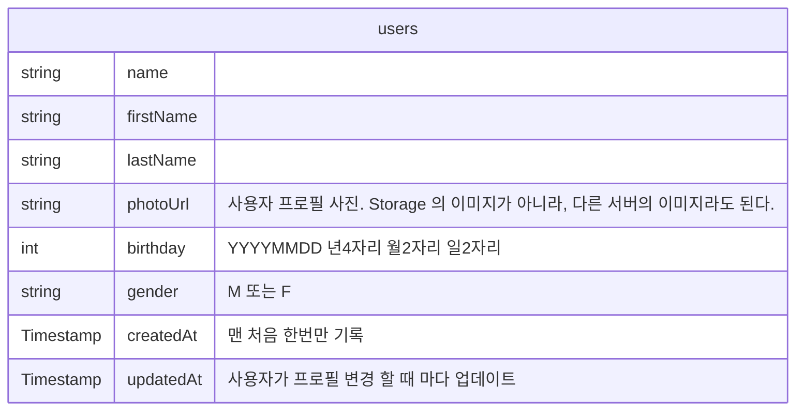
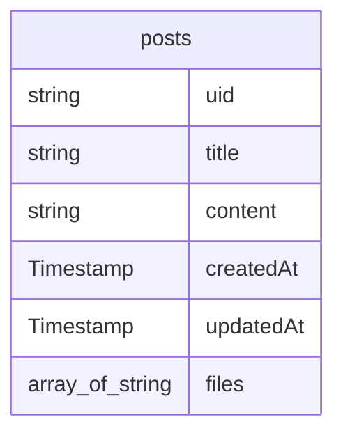
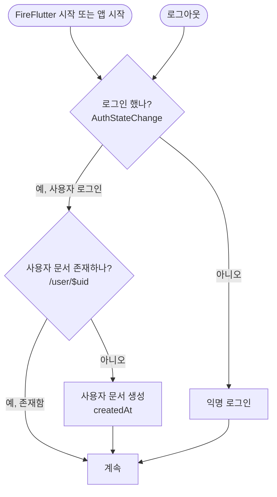

# FireFlutter v0.3

[English version](README.en.md)


- [FireFlutter v0.3](#fireflutter-v03)
- [개요](#개요)
- [기능 별 데이터 구조](#기능-별-데이터-구조)
  - [사용자](#사용자)
    - [사용자 문서](#사용자-문서)
  - [글](#글)
- [Fireflutter 연동](#fireflutter-연동)
- [사용자 로그인](#사용자-로그인)
- [사진(파일) 업로드](#사진파일-업로드)
  - [업로드된 사진 보여주기](#업로드된-사진-보여주기)
- [글](#글-1)
  - [글 생성](#글-생성)
  - [글 가져오기](#글-가져오기)
  - [글 목록 가져오기](#글-목록-가져오기)

# 개요

- 생산적이지 못하고 성공적이지 못한 결과를 만들어 내는 이유는 오직 하나, 코드를 복잡하 작성하기 때문이다. 반드시, 가장 간단한 코드로 작성되어야 하며 그렇지 않으면 실패하는 것으로 간주한다.
- 파이어베이스 데이터베이스는 NoSQL, Flat Style 구조를 가진다.
  - 그래서, Entity Relationship 을 최소화한다.

# 기능 별 데이터 구조


- 각 기능별 데이터베이스 구조를 설명한다.
- 각 기능별로 하나의 데이터 자료는 하나의 모델 클래스로 연결된다.
  - 해당 모델 클래스는 해당 자료에 대한 속성을 가지고 또한 그 데이터 자료(1개)에 대한 CRUD 기능을 가진다.
  - 예를 들어 사용자 문서 생성, 글 생성, 코멘트 생성은 `UserModel`, `PostModel`, `CommentModel` 의 모델에서 하며, 기타 읽기, 수정, 삭제 등 자료 하나에 대한 기능을 모델이 담고 있다.
- 그 외, 각 기능별 기능은 각 Service 클래스에 기록된다.
  - 예를 들어, 검색과 같이 자료 1개에 대한 기능이 아닌 경우 Service 클래스에 기록되는데, `UserService`, `PostService`, `CommentService` 등이 있다.


## 사용자

### 사용자 문서

- `/users/<uid>` 와 같이 저장되며, 아래의 미리 지정된 필드 외에, 원하는 정보(필드)를 추가적으로 저장 할 수 있다.
- 주의 해야 할 것은 사용자 문서는 누구든지 읽을 수 있다. 따라서 개인 정보를 저장하면 안된다.
- 특히, 전화번호와 이메일주소는 `FirebaseAuth` 의 사용자 계정에 저장한다.

- 미리 지정된 필드 목록



## 글

- `/posts/<postId>` 와 같이 데이터가 저장되며, 아래의 지정된 필드 외에, 원하는 정보(필드)를 추가적으로 지정 할 수 있다.
- 미리 지정된 필드 목록



# Fireflutter 연동

- `pubspec.yaml` 에 package 로 추가를 해도 되고, fork 하여 작업하며 수정 사항을 PR 해도 된다.
- Fireflutter 를 앱에 연동하기 위해서는 루트 위젯에 `FireFlutter.service.init()` 을 실행한다.

예제)
```dart
class WonderfulKorea extends StatelessWidget {
  const WonderfulKorea({super.key});

  @override
  Widget build(BuildContext context) {
    FireFlutter.instance.init();
    // ...
```

# 사용자 로그인



- 사용자가 로그인을 하지 않은 경우(또는 로그아웃을 한 경우), 자동으로 `Anonymous` 로 로그인을 한다.
- 사용자가 로그인을 하는 경우, 또는 로그인이 되어져 있는 경우, 사용자 문서를 미리 읽어 (두번 읽지 않고) 재 활용을 해 왔는데, 심플한 코드를 위해서 미리 읽지 않는다.
  - 사용자의 정보 표현이 필요한 곳에서는 `MyDoc` 위젯을 사용한다.
  - 만약, (문서 읽기 회 수를 줄이기 위해) 사용자 문서를 미리 읽어 재 활용하고자 한다면, 클라이언트 앱에서 한다.

# 사진(파일) 업로드

- 사용자가 업로드하는 사진은 Storage 의 `/users/<uid>` 에 저장된다.
  - 시간이 지날 수록 사진 업로드의 수가 많아져 하나의 폴더에 모두 넣으면 관리가 어려워 진다.

- Storage 권한은 아래와 같이 지정한다.

```text
match /users/{uid} {
  allow read: if true;
  allow write: if uid == request.auth.uid;
}
```

- 사진은 [Resize Images](https://firebase.google.com/products/extensions/firebase-storage-resize-images) 익스텐션을 사용해서 자동 썸네일을 생성한다.
  - 썸네일은 `_320x320.webp` 로 저장되도록 해야 한다.
    - 이렇게 하기 위해서는 설정을 `이미지 저장 경로` 를 `/users` 로 지정하고, 썸네일을 `320x320` 크기로 `webp` 형태로 저장하면 된다.
  - 업로드 한 이미지는 `UploadedImage` 위젯을 통해 보여주면 된다.

- 파일 업로드 예제

```dart
FileUploadButton(
  type: 'user',
  onProgress: (p) => setState(() => this.p = p),
  onUploaded: (url) async {
    await UserService.instance.update({'photoUrl': url});
    setState(() => p = 0);
  }
  child: ...
```

## 업로드된 사진 보여주기


- 사진을 업로드 후, 보열 줄 때에는 `UploadedImage` 를 사용하면 된다. 이 위젯은 썸네일된 이미지가 있으면 보여주고 없으면 원본 이미지를 보여준다.

- `UploadedImage` 예제)

```dart
UploadedImage(
  url: user.photoUrl,
  width: size,
  height: size,
  loader: SizedBox.shrink(),
)
```


- 사용자 프로필을 보여 줄 때 `ProfilePhoto` 위젯을 쓰면 되는데, 이 위젯은 사용자 문서를 입력 받아서 그 사용자의 `photoUrl` 에 있는 프로필 사진을 보여주는 것이다. 내부적으로 `UploadedImage` 를 사용한다.
  - `GestureDector` 나 `MyDoc`, `UserDoc` 등으로 감싸서 활용 할 수 있다.

```dart
MyDoc(
  builder: (my) => ProfilePhoto(
    user: my,
    size: 100,
    emptyIcon: const Icon(
      Icons.person,
      color: Color.fromARGB(255, 111, 111, 111),
      size: 90,
    ),
  ),
),
```

# 글

## 글 생성

- 글을 작성하기 위해서는 `PostModel.create()` 함수를 호출하면 된다.
- `ForumMixin` mixin 의 `onPostEdit`

## 글 가져오기

- 글 하나 가져오기는 `PostModel.get()` 으로 할 수 있다.

## 글 목록 가져오기

- 글 목록 가져오기는 `PostService.instance.get()` 을 통해서 할 수 있다.

- 예제)

```dart
List<PostModel> photos = await PostService.instance.get(
  category: 'news',
  limit: 5,
  hasPhoto: true,
);
```