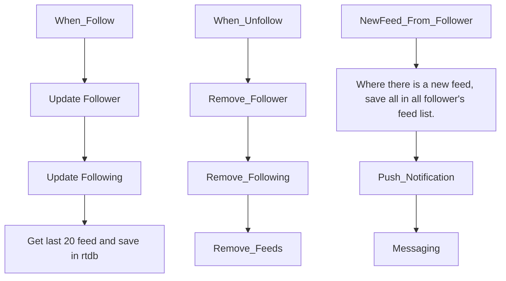
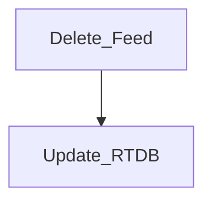
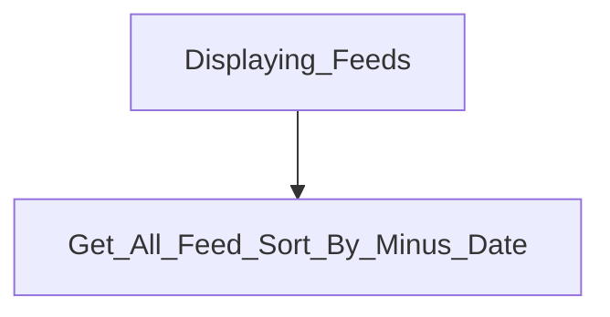

# FireFlutter


If you are looking for a package that help you develop a full featured content management app, then you have found a right one. FireFlutter is a free, open source, complete, rapid development package for creating apps like CMS(content management system), social service, chat, community(forum), shopping mall and much more based on Firebase.

Create an issue if you find a bug or need a help.

- [FireFlutter](#fireflutter)
- [Overview](#overview)
  - [Features](#features)
    - [Main Features](#main-features)
- [Getting started](#getting-started)
  - [Installation](#installation)
  - [Create a Firebase](#create-a-firebase)
- [Firebase Extension](#firebase-extension)
    - [Resize image](#resize-image)
  - [Install cloud functions](#install-cloud-functions)
  - [Security rules](#security-rules)
    - [Firestore security rules](#firestore-security-rules)
    - [Security rule for admin](#security-rule-for-admin)
    - [Realtime database security rules](#realtime-database-security-rules)
  - [Setup the base code](#setup-the-base-code)
  - [url\_launcher (Optional)](#url_launcher-optional)
- [Pub.dev Packages](#pubdev-packages)
  - [timeago](#timeago)
  - [Parsed\_ReadMore](#parsed_readmore)
- [How to build a user profile page](#how-to-build-a-user-profile-page)
    - [1. Create Scaffold widgets](#1-create-scaffold-widgets)
    - [2. UserBuilder()](#2-userbuilder)
  - [Result](#result)
- [How to build a chat app](#how-to-build-a-chat-app)
- [How to build a forum app](#how-to-build-a-forum-app)
- [Usage](#usage)
  - [UserService](#userservice)
  - [PostService](#postservice)
  - [CommentService](#commentservice)
  - [ChatService](#chatservice)
    - [How to open 1:1 chat room](#how-to-open-11-chat-room)
    - [How to display chat room menu](#how-to-display-chat-room-menu)
    - [Customizing the chat header](#customizing-the-chat-header)
- [Widgets and UI functions](#widgets-and-ui-functions)
  - [AuthChanges](#authchanges)
  - [UserDocReady](#userdocready)
  - [TopDownGraident and BottomUpGraident](#topdowngraident-and-bottomupgraident)
  - [CommentOneLineListTile](#commentonelinelisttile)
  - [CommentListBottomSheet](#commentlistbottomsheet)
  - [UserLikedByListScreen](#userlikedbylistscreen)
  - [alert](#alert)
  - [toast](#toast)
  - [warningSnackBar](#warningsnackbar)
  - [prompt](#prompt)
  - [input](#input)
  - [randomString](#randomstring)
  - [timeago](#timeago-1)
  - [getYoutubeIdFromUrl](#getyoutubeidfromurl)
  - [getYoutubeThumbnail](#getyoutubethumbnail)
  - [PostLikeButton](#postlikebutton)
  - [Screen widgets](#screen-widgets)
  - [EmailLoginForm](#emailloginform)
  - [UserDoc](#userdoc)
  - [User public screen customization](#user-public-screen-customization)
  - [Avatar](#avatar)
  - [UserAvatar](#useravatar)
  - [UserProfileAvatar](#userprofileavatar)
  - [User List View](#user-list-view)
    - [UserListView.builder](#userlistviewbuilder)
  - [When user is not logged in](#when-user-is-not-logged-in)
  - [IconTextButton](#icontextbutton)
  - [CarouselView](#carouselview)
- [Chat Feature](#chat-feature)
  - [Welcome message](#welcome-message)
  - [No of new message](#no-of-new-message)
  - [Total no of new message](#total-no-of-new-message)
    - [Chat Room List](#chat-room-list)
    - [Create a chat room](#create-a-chat-room)
    - [How to display a chat room](#how-to-display-a-chat-room)
    - [Additional information](#additional-information)
    - [How to test \& UI work Chat room screen](#how-to-test--ui-work-chat-room-screen)
      - [Chat Room fields](#chat-room-fields)
      - [Chat Message fields](#chat-message-fields)
    - [Counting no of new messages](#counting-no-of-new-messages)
    - [Displaying chat rooms that has new message (unread messages)](#displaying-chat-rooms-that-has-new-message-unread-messages)
    - [1:1 Chat and Multi user chat](#11-chat-and-multi-user-chat)
  - [UI Customization](#ui-customization)
    - [Chat room list](#chat-room-list-1)
  - [Chat Room Menu](#chat-room-menu)
  - [Chat Room Settings](#chat-room-settings)
- [User](#user)
  - [Like](#like)
  - [Favorite/Bookmark](#favoritebookmark)
    - [How to display icon](#how-to-display-icon)
  - [Follow and Unfollow](#follow-and-unfollow)
  - [No of profile view](#no-of-profile-view)
- [Post](#post)
  - [Post Document Strucutre](#post-document-strucutre)
  - [Post view screen custom design](#post-view-screen-custom-design)
  - [List of viewer on each post](#list-of-viewer-on-each-post)
- [Database](#database)
  - [Get/Set/Update/Toggle](#getsetupdatetoggle)
  - [Database widget](#database-widget)
  - [DatabaseCount widget](#databasecount-widget)
- [Settings](#settings)
- [Report](#report)
- [Upload](#upload)
  - [Photo upload](#photo-upload)
- [No of view](#no-of-view)
- [Push notifications](#push-notifications)
  - [Push notification settings](#push-notification-settings)
    - [Push notifcation sound](#push-notifcation-sound)
  - [Customizing source](#customizing-source)
- [Following and Follower](#following-and-follower)
  - [Feed listing logic](#feed-listing-logic)
  - [How to follow](#how-to-follow)
  - [How to unfollow](#how-to-unfollow)
- [Block](#block)
- [Customization](#customization)
  - [User profile screen customization](#user-profile-screen-customization)
  - [Share](#share)
- [Callbacks](#callbacks)
  - [Chat Customization](#chat-customization)
- [Services](#services)
  - [ShareService](#shareservice)
    - [Customizing share button on public profile](#customizing-share-button-on-public-profile)
- [Error handling](#error-handling)
- [Admin](#admin)
  - [Admin Widgets](#admin-widgets)
    - [Opening admin dashbard](#opening-admin-dashbard)
    - [AdminUserListView](#adminuserlistview)
    - [Updating auth custom claims](#updating-auth-custom-claims)
    - [Disable user](#disable-user)
- [Translation](#translation)
- [Unit Testing](#unit-testing)
  - [Testing on Local Emulators and Firebase](#testing-on-local-emulators-and-firebase)
  - [Testing security rules](#testing-security-rules)
  - [Testing on real Firebase](#testing-on-real-firebase)
  - [Testing on Cloud Functions](#testing-on-cloud-functions)
- [Developer](#developer)
  - [Installing your app with fireflutter](#installing-your-app-with-fireflutter)
  - [Development Tips](#development-tips)
- [Contribution](#contribution)
  - [Install FireFlutter and Example Project](#install-fireflutter-and-example-project)
  - [Coding Guideline](#coding-guideline)


# Overview
Fireflutter made for reusing the common code blocks. Provides code for user, forum, chat and push notificiation management with `like`, `favorite`, `follow`, `post` and `comment` features.

There are some pre-defined fields for the user document. You can use `json_serializable` for providing each model extra fields.

The model has also basic CRUD functionalities.

<!-- paraphrased for readability, feel free to edit -->

<!-- I made it for reusing the most common code blocks when I am building apps. It provides the code for user management, forum(caetgory, post, comment) management, chat management, push notification management along with `like`, `favorite`, `following` features.

I use `json_serializable` for the modeling providing each model can have extra fields. For instance, there are some pre-defined fields for the user document and you may add your own fields on the document. The model has also basic CRUD functionalities. -->

## Features

There are many features and most of them are optional. You may turn on the extra functions by the setting.

### Main Features

- User
- Chat
- Forum
- Push notification
- Like
- Favorite(Bookmark)
- Following
- Admin

# Getting started

To get started, you can follow the [Installation](#installation) chapter.

The best way is to copy codes from the example project and paste it into your project and update the UI.

## Installation

Follow the instruction below to install FireFlutter into your app
<!-- Please follow the instructions below to install the fireflutter into your app. -->

## Create a Firebase

If you have your own firebase project, then you can use that. If you don't have one, create one first. Visit [Firebase Website](https://firebase.google.com).


<!-- ## Install the easy extension

We built a firebase extension for the easy management on firebase. FireFlutter is using this extension. Install the [latest version of easy-extension](https://github.com/thruthesky/easy-extension).


Choose Easy Extension version and it will redirect you to Firebase. Choose the project you want Easy Extension to be installed. -->

# Firebase Extension

<!-- Aside from `easy-extension`, you will need to install the following extensions -->

### Resize image


`Deletion of original file` - Don't delete  
`Make resized images public` - yes


`Cache-Control header for resized images` - "max-age=86400"
`Convert image to preferred types` - select `webp` only.


And choose `backfill` if you have an existing images.


All other options are on your choice.

To display the thumbnail image, you may use `.thumbnail` String extension method. `CachedNetworkImage(imageUrl: url.thumbnail)`

## Install cloud functions

Since the firebase extension does not support on sending push notification with node.js SDK, we just made this function as cloud function.
To install,

```sh
git clone https://github.com/thruthesky/fireflutter
cd fireflutter/firebase/functions
npm i
firebase use --add <project>
npm run deploy
```

**Note:**
if you see error like `v2 function name(s) can only contain lower case letters, numbers, hyphens, and not exceed 62 characters in length`, then install the latest version of npm, nodejs, firebase.

**Note:**
if you see warnings like `functions: Since this is your first time using 2nd gen functions, we need a little bit longer to finish setting everything up. Retry the deployment in a few minutes.`, then take 5 minutes break and re-deploy.

## Security rules

### Firestore security rules

Security rules for firestore are under `/firebase/firestore/firestore.rules`.

<!-- TODO: Firestore rule complete update -->

Copy [the security rules of fireflutter](https://raw.githubusercontent.com/thruthesky/fireflutter/main/firebase/firestore/firestore.rules) and paste it in your firebase project. You may need to copy only the parts of the necessary security rules.

<!-- 
TODO:
deploy rules on firebase using cli
 firebase deploy --only <name>.rules
 -->

### Security rule for admin

You can add your uid (or other user's uid) to the `adminUIDs` variable in `isAdmin` function in the security rule. With this way, you don't have to pay extra money for validating the user is admin or not.

```dart
function isAdmin() {
  let adminUIDs = ['root', 'admin', 'CYKk5Q79AmYKQEzw8A95UyEahiz1'];
  return request.auth.uid in adminUIDs || request.auth.token.admin == true;
}
```

After setting the admin, you can now customize your security rules to restrict some write access from other user. You can add sub-admin/s from client app without editing the security rules everytime.

<!-- Once the admin is set, you can customize your security rules to restrict some documents to write access from other users. By doing this way, you can add sub-admin(s) from client app (without editing the security rules on every time when you add subadmin) -->

For instance, you may write security rules like below and add the uids of sub-admin users. then, add a security rule function to check if the user is sub-admin.

```ts
  /settings/sub-admins {
    allow read, write: if isAdmin();
  }
  function isSubAdmin() {
    ...
  }
```
<!-- ### Admin settings

See the [Security rules for admin](#security-rule-for-admin) chapter to set admin in the security rules. After this, you can set the `isAdmin` field to true on the admin's user document. -->

### Realtime database security rules

Enable Realtime Database on firebase and copy the following and paste it into your firebase project.

```json
{
  "rules": {
    "users": {
      ".read": true,
      "$uid": {
        ".write": "$uid === auth.uid"
      }
    },
    "chats": {
      "noOfNewMessages": {
        "$uid": {
          ".read": true,
          ".write": true
        }
      }
    },
    // User profile likes
    "likes": {
      ".read": true,
      "$uid": {
        "$other_uid": {
          ".write": "$other_uid === auth.uid"
        }
      }
    },
    "feeds": {
      ".read": true,
      ".write": true,
      "$uid": {
        ".indexOn": ["createdAt"]
      }
    },
    "posts": {
      ".read": true,
      "$post_id": {
        "seenBy": {
          "$uid": {
            ".write": "$uid == auth.uid"
          }
        },
        // post likes
        "likedBy": {
          "$uid": {
            ".write": "$uid == auth.uid"
          }
        }
      }
    },
    "comments": {
      ".read": true,
      "$comment_id": {
        // comment likes
        "likedBy": {
          "$uid": {
            ".write": "$uid == auth.uid"
          }
        }
      }
    },
    "blocks": {
      "$my_uid": {
        ".read": "$my_uid == auth.uid",
        ".write": "$my_uid == auth.uid"
      }
    },
    "tmp": {
      ".read": true,
      ".write": true
    }
  }
}
```
<!-- Commented out -->
<!-- ### Security Rules for Stroage

You can copy this rules and paste into the rules of storage.

```json

``` -->


## Setup the base code


FireFlutter needs the app to initialize with the Firebase before using it.

Do the settings to connect to firebase.
```
flutterfire configure
```

Add firebase dependencies
``` 
flutter pub add firebase_core
flutter pub add firebase_auth
```

Then, connect your app to firebase.

```dart
import 'package:firebase_core/firebase_core.dart';

void main() async {
  WidgetsFlutterBinding.ensureInitialized();
  await Firebase.initializeApp();
  runApp(const MyApp());
}
```

Then, initialize FireFlutter like below

```dart
class _MyAppState extends State<MyApp> {
  @override
  void initState() {
    super.initState();

    /// Initialize FireFlutter
    FireFlutterService.instance.init(context: ...);
  }
}
```

FireFlutter has many features and each feature has a singleton service class. You need to initialize each of the singleton on your needs.

FireFlutter needs **Global Key** since it uses `snackbars`, `dialog`, `bottom sheet`. Use the **`FireFlutterService.instance.init(context : ...)`**

**Note:**
You don't have to initialize when you are only doing unit test.

<!-- Since, fireflutter uses `snackbars`, `dialog`, `bottom sheet`, it needs global key (or global build context). Put the global key into the `FireFlutterService.instance.init(context: ...)`. If you are not going to use the global key, you may not need to initialzie it like when you are only doing unit test. -->

**Note:**
If you meet an error like `No MaterialLocalizations found. Xxxx widgets require MaterialLocalizations to be provided by a Localizations widget ancestor.`, then you may think a widget is not under MaterialApp or no localization provided. In this case, the context from global key will be used. For more details, See <https://docs.flutter.dev/release/breaking-changes/text-field-material-localizations>.

For instance, if you are using [go_route package](https://pub.dev/packages/go_router), you can pass the global build context like below.

```dart
//  initialize admin 
UserService.instance.init(adminUid: 'xxx');

WidgetsBinding.instance.addPostFrameCallback((timeStamp) {
  FireFlutterService.instance.init(context: router.routerDelegate.navigatorKey.currentContext!);
})
```

If you are using the flutter's default `Navigator` for routing, define the global key like below first,

```dart
import 'package:flutter/material.dart';

GlobalKey<NavigatorState> globalNavigatorKey = GlobalKey();
BuildContext get globalContext => globalNavigatorKey.currentContext as BuildContext;
```

Then connect it to MaterialApp like below

```dart
MaterialApp(
  navigatorKey: globalNavigatorKey,
)
```

Then, store the global context into fireflutter like below

```dart
class _MainWidgetState extends State<MainWidget>{

  @override
  void initState() {
    super.initState();

    WidgetsBinding.instance.addPostFrameCallback((timeStamp) {
      FireFlutterService.instance.init(
        context: globalContext,
      );
    });
  }
}
```

By default, feed feature is disabled. To use feed features, add the following in app widget.

```dart
FeedService.instance.init(enable: true);
```

## url_launcher (Optional)

`url_lancher` package is added by fireflutter and it is being used to open url. If you wish to let users share links by sms, you need to setup in `AndroidManifest.xml` and `Info.plist`. See the [url_launch Configuration](https://pub.dev/packages/url_launcher#configuration).

FireFlutter exposes a method `launchSMS` to open the SMS app. Here is an example of how to send sms. You can build your own code, of course.

```dart
final re = await launchSMS(phnumber: '', msg: link);
if (re) {
  toast(title: 'SMS', message: 'Link sent by SMS');
} else {
  toast(title: 'SMS', message: 'Cannot open SMS');
}
```

# Pub.dev Packages

In this chapter, some of the notable packages that are used by FireFlutter are explained.

## timeago
Converts date into a humanized text.
```dart
    final fifteenAgo = DateTime.now().subtract(Duration(minutes: 15));

    print(timeago.format(fifteenAgo)); // 15 minutes ago
    print(timeago.format(fifteenAgo, locale: 'en_short')); // 15m
    print(timeago.format(fifteenAgo, locale: 'es')); // hace 15 minutos
```

Visit [timeago](https://pub.dev/packages/timeago) to read more.

## Parsed_ReadMore

Allows the text to collapsed or expanded and automatically parse the url text to hyperlinks.

Visit [parsed_readmore](https://pub.dev/packages/parsed_readmore) to read more.

<!-- TODO: -->
# How to build a user profile page 

<!-- will revised this continously while studying fireflutter -->

Here is an example of how to build simple user profile page.

### 1. Create Scaffold widgets
Build your own design of your app.
```dart
@override
  Widget build(BuildContext context) {
    Size size = MediaQuery.of(context).size; // get device's size
    return Scaffold(
      appBar: _myOwnAppBar(context), //custom AppBar
      body: SizedBox(
        width: size.width,
        child: const Column(
          children: [
            UserBuilder(), // Profile image Builder
            /*
             * ... Other Widgets here
             */
          ],
        ),
      ),
    );
  }
```

### 2. UserBuilder()

[**UserDoc**](#userdoc) is responsible for taking all the documents of user from the database. With the help of [**UserProfileAvatar**](#userprofileavatar) we can display the user's profile photo to our app.   

```dart
class UserBuilder extends StatelessWidget {
  const UserBuilder({super.key});

  @override
  Widget build(BuildContext context) {
    return UserDoc(builder: (user) {
      return Row(
        mainAxisAlignment: MainAxisAlignment.center,
        children: [
          UserProfileAvatar( // displays the user's profile photo
            radius: 20,
            user: user,
            size: 100,
            upload: true,
          ),
          const SizedBox(width: 20),
          Column(
            crossAxisAlignment: CrossAxisAlignment.start,
            mainAxisAlignment: MainAxisAlignment.spaceAround,
            children: [
              // you can change this based on your needs
              _textBuilder(context, my.email),
              _textBuilder(context, my.uid),
              _textBuilder(context, my.hasPhotoUrl.toString()),
            ],
          ),
        ],
      );
    });
  }
}
```

## Result
Here is a sample result

***Note:*** [**UserProfileAvatar**](#userprofileavatar) returns an icon that will serve as a default profile picture if the user doesn't have any picture uploaded.


# How to build a chat app

# How to build a forum app

# Usage

## UserService
<!-- #section removed 
  reason: documentNotExistBuilder has been removed
  
In this case, the `documentNotExistBuilder` of `UserDoc` will be called. 

So, the lifecyle will be the following when the app users `UserDoc`. 

- `UserService.instance.nullableUser` will have an instance of `User`
  - If the user document does not exists, `exists` will be `false` causing `documentNotExistsBuilder` to be called.
  - If the user document exist, then it will have right data and `builder` will be called. -->

`UserService.instance.nullableUser` is *null* when
- on app boot
- the user don't have documents
- when user has document but `UserService` has not read the user document yet.

<!-- **Note:** Use ***async*** to wait UserService to load the data -->

`UserService.instance.nullableUser.exists` is *null* if the user has logged in but no document. 

The `UserService.instance.user` or `UserService.instance.documentChanges` may be null when the user document is being loaded on app boot. So, the better way to get the user's document for sure is to use `UserService.instance.get`

Right way of getting a user document.

```dart
UserService.instance.get(myUid!).then((user) => ...);
```

You cannot use `my` until the UserService is initialized and `UserService.instance.user` is available. Or you will see `null check operator used on a null value.`

<!-- .customize does not exist[???], 

TODO: Learning it more so i can replace it
  
  might remove since there is already a section of Post Below
-->

<!-- ## PostService

### How to open a post 
Call the `showPostViewScreen` to show the full screen dialog that displays the post

```dart
PostService.instance.customize.postViewScreenBuilder = (post) => GRCCustomPostViewScreen(post: post);
```

### Customizing a Post View

Build your own UI design of the full screen Post View like below.

```dart
PostService.instance.customize.postViewScreenBuilder = (post) => GRCCustomPostViewScreen(post: post);
```

The widget is preferrably a full screen widget. It can be a scaffold, sliver, etc. -->

## PostService

If `enableNotificationOnLike` is set to true, then it will send push notification to the author when there is a like. You would do the work by adding `onLike` callback.

```dart
PostService.instance.init(
  onLike: (Post post, bool isLiked) async {
    if (!isLiked) return;
    MessagingService.instance.queue(
      title: post.title,
      body: "${my.name} liked your post.",
      id: myUid,
      uids: [post.uid],
      type: NotificationType.post.name,
    );
  },
  // When it is set to true, you don't have add `onLike` callback to send push notification.
  enableNotificationOnLike: true,
```


## CommentService


You can customize the `showCommentEditBottomSheet` how to comment edit(create or update) box appears.

The code below simply call `next()` function which does exactly the same as the default logic from `fireflutter`.

```dart
CommentService.instance.init(
  customize: CommentCustomize(
    showCommentEditBottomSheet: (
      BuildContext context, {
      Comment? comment,
      required Future<Comment?> Function() next,
      Comment? parent,
      Post? post,
    }) {
      return next();
    },
  ),
);
```

You may add some custom code like below.

```dart
CommentService.instance.init(
  customize: CommentCustomize(
    showCommentEditBottomSheet: (
      BuildContext context, {
      Comment? comment,
      required Future<Comment?> Function() next,
      Comment? parent,
      Post? post,
    }) {
      if (my.isComplete == false) {
        warning(context, title: '본인 인증', message: '본인 인증을 하셔야 댓글을 쓸 수 있습니다.');
        return Future.value(null);
      }
      return next();
    },
  ),
);
```

Or you can do the UI/UX by yourself since it delivers everything you need to show comment edit box.


## ChatService

### How to open 1:1 chat room

Use the `showChatRoom` method anywhere with user model.

```dart
ChatService.instance.showChatRoom(context: context, user: user);
```

### How to display chat room menu

Since all app have different features and design, you can customize or rebuild it. See the code below and paste them into your project.

<!-- By default, it has a full screen dialog with default buttons. Since all apps have difference features and design, you will need to customize it or rebuild it. But see the code inside and copy and paste them into your project. -->
<!-- body: ChatRoomMenuUserInviteDialog(room: room), -->

How to show chat room dialog.

```dart
showGeneralDialog(
  context: context,
  pageBuilder: (context, _, __) => Scaffold(
    appBar: AppBar(
      title: const Text('Invite User'),
    ),
    body: CustomChatWidget(),
  ),
);
```

### Customizing the chat header

You can build your own chat header like below.

```dart
ChatService.instance.customize.chatRoomAppBarBuilder = (room) => MomCafeChatRoomAppBar(room: room);
```

# Widgets and UI functions

- The widgets in fireflutter can be a small piece of UI representation or it can be a full screen dialog.

- The file names and the class names of the widgets must match.
- The user widgets are inside `widgets/user` and the file name is in the form of `user.xxxx.dart` or `user.xxxx.dialog.dart`. And it goes the same to chat and forum.

- There are many service methods that opens a screen. One thing to note is that, all the method that opens a screen uses `showGeneralDialog` which does not modify the navigation stack. If you want, you may open the screen with navigation(routing) like `Navigator.of(context).push...()`.

**Note:** you can use **`Theme()`** to style the widget 


## AuthChanges


```dart
AuthChange(
  builder: (u) => u == null ?
    Text('Register') : Text('uid: ${user.uid}'),
);
```

## UserDocReady


```dart
UserDocReady(builder: (my) {
  return Row(
    children: [
      UserProfileAvatar( user: my ),
      Column(
        children: [
          Text(my.name),
          Text("${my.birthYear}-${my.birthMonth}-${my.birthDay}"),
        ],
      ),
    ],
  );
}),
```


## TopDownGraident and BottomUpGraident

`TopDownGraident()` and `BottomUpGraident()` provides 
gradient on top and bottom part of the app. You can use this to design your entry screen or the splash screen.

Using them inside of the `Row()` or `Column()` will return an error below


```sh
Another exception was thrown: Incorrect use of ParentDataWidget.
```
You can use this widgets like this

``` dart
Stack(
  children: [
    TopDownGraident(
      height: 150,
    ),
    BottomUpGraident(
      height: 100,
    ),
  ],
),
```

## CommentOneLineListTile

<!-- TODO: 
  - code errors permission_denied is the reason why not working properly,
  - Note: I added the id as an admin
 -->
Below is a sample code how to use and customizing `CommentOneLineListTile` widget.

```dart
Theme(
  data: Theme.of(context).copyWith(
    textTheme: TextTheme(
      bodySmall: Theme.of(context).textTheme.bodySmall!.copyWith(
            fontSize: 12,
            color: Colors.red,
          ),
    ),
  ),
  child: CommentOneLineListTile(
    post: Post.fromJson({'id': '1'}),
    comment: Comment.fromJson({
      'id': '2',
      'postId': '1',
      'uid': '2ItnEzERcwO4DQ9wxLsWEOan9OU2',
      'sort': '...',
      'depth': 1,
      'content': "This is a test content.\nHello, there.\nYo!",
      'urls': ['https://picsum.photos/id/100/100/100', 'https://picsum.photos/id/101/100/100'],
    }),
  ),
),
```
<!-- Fixed -->
## CommentListBottomSheet

This widget shows the comment list of the post in a bottom sheet UI style.
Use this widget with `showModalBottomSheet`.

```dart
Post post = Post(id: 'xxx');
await showModalBottomSheet(
  context: context,
  builder: (ctx) => CommentListBottomSheet(post: post),
);
```
<!-- renamed from UserLikeListScreen to UserLikedByListScreen -->
## UserLikedByListScreen

This screen shows a list of users who liked a post, comment, or a profile.
Use this screen to show a user list and when it is tapped, show public profile.

```dart
UserLikedByListScreen(
    uids: ['xxx''xxx''xxx'], // list of ids
  ),
```

## alert

Use `alert` method to display a dialog to alert(alarm) the user.

```dart
await alert(
  context: context,
  title: 'Withdrawal',
  message: 'I have canceled my membership.');
```
  <!-- 
  translated into english
  title: '회원 탈퇴',
  message: '회원 탈퇴를 하였습니다.'); -->
## toast

Use `toast` to display a toast notification

```dart
toast(
  icon: const Icon(Icons.link),
  title: url,
  message: 'Open the link?',
  onTap: (p0) => launchUrl(Uri.parse(url)),
);
```

## warningSnackBar
Use `warningSnackbar` to display a warning message
```dart
warningSnackbar(context, 'Warning message');
```
## prompt

Use `prompt` to get a string value from user.

```dart
final password = await prompt(
  context: context,
  title: 'Resign',
  message: 'Please input your password to resign.',
);
```

## input

`input` is an alias of `prompt`.
```dart
onTap: () => input(
  context: context,
  title: 'this is input()',
  message: 'Hello World!',
),
```

## randomString

Returns a random string.

```dart
// randomString() has default length value of 12
// define the length of the String result
int length = 5;
onTap: () {
  String result = randomString(length); // or randomString()
  setState(() {
    text = result;
  });
},
```

## timeago

Returns a string of human readable time ago string. It supports i18n. See [**timeago**](#timeago) above.

## getYoutubeIdFromUrl

Returns the Youtube ID of a URL
<!-- Use this method to get youtube id from the youtube url. -->

```dart
onTap: () {
  String? result = getYoutube("url");
  setState(() {
    ytId = result ?? 'url has no ID';
  });
},
```

## getYoutubeThumbnail

Returns the url of Youtube Thumbnail from ID
<!-- Use this method to get the YouTube video's thumbnail from the yotube id. -->

```dart
onTap: () {
  // you can use the getYoutubeIdFromUrl() to get the Youtube ID
  String? result = getYoutubeIdFromUrl(url);
  String thumbNail = getYoutubeThumbnail(
    videoId: result ?? '', // required field
    quality: YoutubeThumbnailQuality.high,
    webp: false, 
  );
  setState(() {
    ytThumbNail = thumbNail;
  });
},
```

<!-- TODO: 
  - post returns an int 
  - getter iLiked is gone or replaced [???]
  - relearn
 -->

## PostLikeButton

Use this widget for like and unlike.

```dart
PostLikeButton(
  padding: const EdgeInsets.all(sizeXs),
  post: post,
  builder: (post) => Icon(post.iLiked ? Icons.thumb_up : Icons.thumb_up_outlined),
),
```

## Screen widgets

The name of widgets that can be used as a screen ends with `Screen`. Those widget must be work as a screen or a dialog of `showGeneralDialog()`. Which means those widgets must have a scaffold.

Example of opening a screen widget with `showGeneralDialog()`

```dart
showGeneralDialog(
  context: context,
  pageBuilder: (_, __, ___) => const AdminDashboardScreen(),
);
```

Example of opening a screen widget with `Navigator`

```dart
Navigator.of(context).push(
  MaterialPageRoute(builder: (c) => const AdminDashboardScreen()),
);
```

## EmailLoginForm

Use this widget for creating and logging-in with email/password. This widget is designed for test use.

***EmailLoginForm()*** structure:


```dart
class EmailLoginForm extends StatefulWidget {
  const EmailLoginForm({
    super.key,
    this.register = true,
    this.onLogin,
  });

  final bool register;
  final VoidCallback? onLogin;
}
```

You can use `Theme()` to design the widgets. Example below:

``` dart
Theme(
  data: ThemeData(
    elevatedButtonTheme: ElevatedButtonThemeData(
      style: ElevatedButton.styleFrom(
        backgroundColor: Theme.of(context).primaryColor.withAlpha(200),
                    ),
                ),
              ),
              child: EmailLoginForm(
                // a function that will trigger if login is successful
                onLogin: () => context.push(HomePage.routeName),
                // removes the register button
                register: false,
              ),
            ),
```

## UserDoc

To display user's profile photo, use like below.
<!-- See the comment for the details. -->

```dart
UserDoc(
  builder: (user) => UserProfileAvatar(
    user: user,
    size: 38,
    shadowBlurRadius: 0.0,
    onTap: () => context.push(ProfileScreen.routeName),
    defaultIcon: const FaIcon(FontAwesomeIcons.lightCircleUser, size: 38),
    backgroundColor: Theme.of(context).colorScheme.inversePrimary,
  ),
),
```

<!--   
Not exist anymore:
documentNotExistBuilder: () {
    // Create user document if not exists.
    UserService.instance.create();
    return const SizedBox.shrink();
  },
   -->

## User public screen customization

To customize the user public profile screen, you can override the showPublicProfileScreen function.

```dart
UserService.instance.customize.showPublicProfileScreen =
    (BuildContext context, {String? uid, User? user}) => showGeneralDialog<dynamic>(
          context: context,
          pageBuilder: ($, _, __) => MomcafePublicProfileScreen(
            uid: uid,
            user: user,
          ),
        );
```

You may partly want to customize the public profile screen instead of rewriting the whole code.

You may hide or add buttons like below.

```dart

    // Public profile custom design

    // Add menu(s) on top of public screen
    UserService.instance.customize.publicScreenActions = (context, user) => [
          FavoriteButton(
            otherUid: user.uid,
            builder: (re) => FaIcon(
              re
                  ? FontAwesomeIcons.circleStar
                  : FontAwesomeIcons.lightCircleStar,
              color: re ? Colors.yellow : null,
            ),
            onChanged: (re) => toast(
              title: re ? tr.favorite : tr.unfavorite,
              message: re ? tr.favoriteMessage : tr.unfavoriteMessage,
            ),
          ),
          PopupMenuButton(
            itemBuilder: (context) => [
              PopupMenuItem(
                value: 'report',
                child: Text(tr.report),
              ),
              PopupMenuItem(
                value: 'block',
                child: Database(
                  path: pathBlock(user.uid),
                  builder: (value) =>
                      Text(value == null ? tr.block : tr.unblock),
                ),
              ),
            ],
            icon: const FaIcon(FontAwesomeIcons.circleEllipsis),
            onSelected: (value) {
              switch (value) {
                case 'report':
                  ReportService.instance.showReportDialog(
                    context: context,
                    otherUid: user.uid,
                    onExists: (id, type) => toast(
                      title: tr.alreadyReportedTitle,
                      message:
                          tr.alreadyReportedMessage.replaceAll('#type', type),
                    ),
                  );
                  break;
                case 'block':
                  toggle(pathBlock(user.uid));
                  toast(
                    title: tr.block,
                    message: tr.blockMessage,
                  );
                  break;
              }
            },
          ),
        ];

    /// Hide some buttons on bottom.
    UserService.instance.customize.publicScreenBlockButton =
        (context, user) => const SizedBox.shrink();
    UserService.instance.customize.publicScreenReportButton =
        (context, user) => const SizedBox.shrink();
```

## Avatar

This is a similiar widget of the `CircleAvatar` in Material UI.

```dart
Avatar(url: 'https://picsum.photos/200/300'),
```

## UserAvatar

To display user's profile photo, use `UserAvatar`.
Not that, `UserAvatar` does not update the user photo in realtime. So, you may need to give a key when you want it to dsiplay new photo url.

```dart
UserAvatar(
  user: user,
  size: 120,
),
```

## UserProfileAvatar

To let user update or delete the profile photo, use like below.

```dart
UserProfileAvatar(
  user: user,
  size: 120,
  upload: true,
  delete: true,
),
```


To customize the look of `UserProfileAvartar`.

```dart
UserProfileAvatar(
  user: my,
  size: 128,
  radius: 16, // radius
  upload: true,
  uploadIcon: const Padding( // upload icon
    padding: EdgeInsets.all(8.0),
    child: FaIcon(
      FontAwesomeIcons.thinPenCircle,
      size: 32,
      color: Colors.white,
    ),
  ),
),
```

## User List View

Use this widget to list users. By default, it will list all users. This widget can also
be used to search users by filtering a field with a string value.

This widget is a list view that has a `ListTile` in each item. So, it supports the properties of `ListView` and `ListTile` at the same time.

```dart
UserListView(
  searchText: 'nameValue',
  field: 'name',
),
```

Example of complete code for displaying the `UserListView` in a dialog with search box

```dart
onPressed() async {
  final user = await showGeneralDialog<User>(
    context: context,
    pageBuilder: (context, _, __) {
      TextEditingController search = TextEditingController();
      return StatefulBuilder(builder: (context, setState) {
        return Scaffold(
          appBar: AppBar(
            backgroundColor: Theme.of(context).colorScheme.inversePrimary,
            title: const Text('Find friends'),
          ),
          body: Container(
            padding: const EdgeInsets.all(20),
            child: Column(
              children: [
                TextField(
                  controller: search,
                  decoration: const InputDecoration(
                    border: OutlineInputBorder(),
                    labelText: 'Search',
                  ),
                  onSubmitted: (value) => setState(() => search.text = value),
                ),
                Expanded(
                  child: UserListView(
                    key: ValueKey(search.text),
                    searchText: search.text,
                    field: 'name',
                    avatarBuilder: (user) => const Text('Photo'),
                    titleBuilder: (user) => Text(user?.uid ?? ''),
                    subtitleBuilder: (user) => Text(user?.phoneNumber ?? ''),
                    trailingBuilder: (user) => const Icon(Icons.add),
                    onTap: (user) => context.pop(user),
                  ),
                ),
              ],
            ),
          ),
        );
      });
    },
  );
}
```

### UserListView.builder

You may use the `UserListView.builder` if you already have the `List<String>` of uids

```dart
List<String> friends = ['uid1', 'uid2']

UserListView.builder(uids: friends)

```

## When user is not logged in

This is one way of how to dsplay widgets safely for not logged in users.

```dart
class FavoriteButton extends StatelessWidget {
  const FavoriteButton({
    super.key,
    // ...
  });


  @override
  Widget build(BuildContext context) {
    // If the user has not logged in yet, display an icon with a warning toast.
    if (notLoggedIn) {
      return IconButton(
        onPressed: () async {
          toast(
              title: tr.user.loginFirstTitle,
              message: tr.user.loginFirstMessage);
        },
        icon: builder(false),
      );
    }
    return StreamBuilder(
      stream: ....snapshots(),
      builder: (context, snapshot) {
        return IconButton(
          onPressed: () async {
            final re = await Favorite.toggle(
                postId: postId, otherUid: otherUid, commentId: commentId);
            onChanged?.call(re);
          },
          icon: builder(snapshot.data?.size == 1),
        );
      },
    );
  }
}

```

## IconTextButton


```dart
IconTextButton(
  icon: const FaIcon(FontAwesomeIcons.arrowUpFromBracket, size: 22),
  iconBackgroundColor: Theme.of(context).colorScheme.secondary.withAlpha(20),
  iconRadius: 20,
  iconPadding: const EdgeInsets.all(12),
  runSpacing: 4,
  label: "SHARE",
  labelStyle: Theme.of(context).textTheme.labelSmall!.copyWith(
        fontSize: 10,
        color: Theme.of(context).colorScheme.secondary,
      ),
  onTap: () {},
),
```

## CarouselView

This can be used to display multiple pictures (or media as widgets) as a carousel like in other social media postings.

To use, check this example code below

```dart
CarouselView(
  widgets: [
    CachedNetworkImage(
      imageUrl: e1.url,
      fit: BoxFit.cover,
      placeholder: (context, url) => const SizedBox(height: 400),
    ),
    CachedNetworkImage(
      imageUrl: e2.url,
      fit: BoxFit.cover,
      placeholder: (context, url) => const SizedBox(height: 400),
    ),
    CachedNetworkImage(
      imageUrl: e3.url,
      fit: BoxFit.cover,
      placeholder: (context, url) => const SizedBox(height: 400),
    ),
  ],
),
```

You can also use a List of URLs to display in carousel as shown below.

```dart
CarouselView(
  urls: [
    'picsum.photos/id/223/200/300',
    'picsum.photos/id/224/200/300',
    'picsum.photos/id/225/200/300',
  ],
),
```

# Chat Feature

## Welcome message

To send a welcome chat message to a user who just registered, use `UserService.instance.sendWelcomeMessage`. See details on the comments of the source.

## No of new message

We save the no of new messages of each users in RTDB. `/chats/noOfNewMessages/{uid}/{roomId: true}`.

## Total no of new message

To display the total no of new messages, use the following widget. If you don't want to listen the changes of no of new message, then you can disable it with `ChatService.instance.init( ... )`

```dart
TotalNoOfNewMessage(),
```

### Chat Room List

- The beginning point would be chat room list screen.

  - On the chat room list screen, you can display chat room create icon and the login user's chat room list.

- Follow the setup first.

- You can display chat room list like below

```dart
final ChatRoomListViewController controller = ChatRoomListViewController();
ChatRoomListView(
  controller: controller,
),
```

You can customsize the chat room item in the list like below. You can replace the `ChatRoomListTile` or you can customize the onTap behavior.

```dart
ChatRoomListView(
  singleChatOnly: true,
  controller: controller,
  itemBuilder: (context, room) => ChatRoomListTile(
    room: room,
    onTap: () => controller.showChatRoom(context: context, room: room),
  ),
)
```

### Create a chat room

- To create a chat room, add a button and display `ChatRoomCreateDialog` widget. You may copy the code from `ChatRoomCreateDialog` and apply your own design.

```dart
class _ChatRoomListreenState extends State<ChatRoomListSreen> {
  @override
  Widget build(BuildContext context) {
    return Scaffold(
      appBar: AppBar(
        title: const Text('Easy Chat Room List'),
        actions: [
          IconButton(
            onPressed: () async {
              showDialog(
                context: context,
                builder: (_) => ChatRoomCreateDialog(
                  success: (room) {
                    Navigator.of(context).pop();
                    if (context.mounted) {
                      controller.showChatRoom(context: context, room: room);
                    }
                  },
                  cancel: () => Navigator.of(context).pop(),
                  error: () => const ScaffoldMessenger(child: Text('Error creating chat room')),
                ),
              );
            },
            icon: const Icon(Icons.add),
          ),
        ],
      ),
      ),
  }
```

<!-- - You need to create only one screen to use the easychat.

```dart
Scafolld(
  appBar: AppBar(
    title:
  )
)
``` -->

### How to display a chat room

- In the chat room, there should be a header, a message list view as a body, and message input box.
- To display the chat room, you need to have a chat room model.
  - To have a chat room model, you need to create a chat room (probably a group chat).
  - Then, you will get it on the app by accessing the database or you may compose it using `ChatRoomModel.fromMap()`.
  - Then, pass the chat room model into the chat room (or you can compose a chat room manually with the chat room model.)

### Additional information

- Please create issues.

### How to test & UI work Chat room screen

```dart

    Timer.run(() {
      // Navigator.of(context).push(MaterialPageRoute(builder: (_) => const ChatScreen()));

// How to test a chat room screen:
      Navigator.of(context).push(
        MaterialPageRoute(
          /// Open the chat room screen with a chat room for the UI work and testing.
          builder: (_) => ExampleChatRoomScreen(
            /// Get the chat room from the firestore and pass it to the screen for the test.
            room: ChatRoomModel.fromMap(
              id: 'mFpHRSZLCemCfC2B9Y3B',
              map: {
                'name': 'Test Chat Room',
              },
            ),
          ),
        ),
      );
    });
```

#### Chat Room fields

- `master: [string]` is the master. root of the chat room.
- `moderators: Array[uid]` is the moderators.
- `group: [boolean]` - if true, it's group chat. otherwise it's 1:1 chat
- `open: [boolean]` - if true, any one in the room can invite and anyone can jogin (except if it's 1:1 chat). If it's false, no one can join except the invitation of master and moderators.
- `createdAt: [timestamp|date]` is the time that the chat room created.
- `users: Array[uid]` is the number of users.
- `noOfNewMessages: Map<string, number>` - This contains the uid of the chat room users as key and the number of new messages as value.
- `lastMessage: Map` is the last message in the room.
  - `createdAt: [timestamp|date]` is the time that the last message was sent.
  - `uid: [string]` is the sender Uid
  - `text: [string]` is the text in the message
- `maximumNoOfUsers: [int]` is the maximum no of users in the group.

#### Chat Message fields

- `text` is the text message [Optional] - Optional, meaning, a message can be sent without the text.
- `createdAt` is the time that the message was sent.
- `uid` is the sender Uid
- `imageUrl [String]` is the image's URL added to the message. [Optional]
- `fileUrl [String]` is the file's URL added to the message. [Optional]
- `fileName` is the file name of the file from `fileUrl`. [Optional]

### Counting no of new messages

- We don't seprate the storage of the no of new message from the chat room document. We have thought about it and finalized that that is not worth. It does not have any money and the logic isn't any simple.
- noOfNewMessages will have the uid and no. like `{uid-a: 5, uid-b: 0, uid-c: 2}`
- When somebody chats, increase the no of new messages except the sender.
- Wehn somebody receives a message in a chat room, make his no of new message to 0.
- When somebody enters the chat room, make his no of new message to 0.

### Displaying chat rooms that has new message (unread messages)

- Get whole list of chat room.
- Filter chat rooms that has 0 of noOfNewmessage of my uid.

### 1:1 Chat and Multi user chat

- 1:1 chat room id must be consisted with `uid-uid` pattern in alphabetically sorted.

- When the login user taps on a chat room, it is considered that the user wants to enter the chat room. It may be a 1:1 chat or group chat.
  - In this case, the app will deliver `ChatRoomModel` as a prameter to chat room list screen and chat room list screen will open the chat room.
- When the login user taps on a user, it means, the login user want to chat with the user. It will be only 1:1 chat.
  - Int his case, the app will deliver `UserModel` as a parameter to chat room list screen and chat room list screen will open the chat room.
  - When the login user taps on a user, the app must search if the 1:1 chat room exsits.
    - If yes, enter the chat room,
    - If not, create 1:1 chat room and put the two as a member of the chat room, and enter.
- When one of user in 1:1 chat invites another user, new group chat room will be created and the three users will be the starting members of the chat room.

  - And the new chat room is a group chat room and more members would invited (without creating another chat room).

- Any user in the chat room can invite other user unless it is password-locked.
- Onlt the master can update the password.
<!-- TODO for confirmation about password -->
- The `inviting` means, the invitor will add the `invitee`'s uid into `users` field.

  - It is same as `joining`. If the user who wants to join the room, he will simply add his uid into `users` field. That's called `joining`.
<!-- 
- Any one can join the chat room if `/easychat/{id}/{ open: true }`. -->

  - 1:1 chat room must not have `{open: false}`.

- If a chat room has `{open: false}`, no body can join the room except the invitation of master and moderators.

- group chat room must have `{group: true, open: [boolean]}`. This is for searching purpose in Firestore.
  - For 1:1 chat room, it must be `{group: false, open: false}`. This is for searching purpose in Firestore.

## UI Customization

UI can be customized

### Chat room list

- To list chat rooms, use the code below.

```dart
ChatRoomListView(
  controller: controller,
  itemBuilder: (context, room) {
    return ListTile(
        leading: const Icon(Icons.chat),
        title: ChatRoomListTileName(
          room: room,
          style: const TextStyle(color: Colors.blue),
        ),
        trailing: const Icon(Icons.chevron_right),
        onTap: () {
          controller.showChatRoom(context: context, room: room);
        });
  },
)
```

## Chat Room Menu

The chat room menu can be accessed by the Chat Room Menu Button. This will open the Chat Room Menu Screen.

```dart
ChatRoomMenuButton(
  room: chatRoomModel,
  onUpdateRoomSetting: (updatedRoom) {
    debugPrint("If a setting was updated. Setting: ${updatedRoom.toString()}");
  },
),
```

The Chat Room Menu consists the following:

- `Invite User` This button opens a List View of users that can be invited to the group chat. To use Invite User Button for List View, follow the code:

```dart
InviteUserButton(
  room: chatRoomModel,
  onInvite: (invitedUserUid) {
    debugPrint("You have just invited a user with a uid of $invitedUserUid");
  },
),
```

<!-- To programatically, invite a user, follow these codes:

```dart
updatedRoom = await EasyChat.instance.inviteUser(room: chatRoomModel, userUid: user.uid);
``` -->

See [Chat Room Settings](#chat-room-settings) for more details

- `Members` This is a List View of the members of the group chat. The user can be marked as [Master], [Moderator] and/or [Blocked]. Tapping the user will open a Dialog that may show options for Setting as Moderator, or Blocking on the group.

## Chat Room Settings

- `Open Chat Room` This setting determines if the group chat is open or private. Open means anybody can join and invite. Private means only the master or moderators can invite. See the code below to use the Default List Tile.

```dart
ChatRoomSettingsOpenListTile(
  room: chatRoomModel,
  onToggleOpen: (updatedRoom) {
    debugPrint('Updated Room Open Setting. Setting: ${updatedRoom.open}');
  },
),
```

To programatically update the setting, follow the code below. It will return the room with updated setting.

<!-- ```dart
updatedRoom = await EasyChat.instance.updateRoomSetting(
  room: chatRoomModel,
  setting: 'open',
  value: updatedBoolValue,
);
``` -->

- `Maximum Number of User` This number sets the limitation for the number of users in the chat room. If the current number of users is equal or more than this setting, it will not proceed on adding the user.

```dart
ChatRoomSettingsMaximumUserListTile(
  room: chatRoomModel,
  onUpdateMaximumNoOfUsers: (updatedRoom) {
    debugPrint('Updated Maximum number of Users Setting. Setting: ${updatedRoom.maximumNoOfUsers}');
  },
),
```

To programatically update the setting, follow the code below. It will return the room with updated setting.

<!-- ```dart
updatedRoom = await EasyChat.instance.updateRoomSetting(
  room: chatRoomModel,
  setting: 'maximumNoOfUsers',
  value: updatedIntValue
);
``` -->

- `Default Chat Room Name` The master can use this setting to set the default name of the Group Chat.

```dart
ChatRoomSettingsDefaultRoomNameListTile(
  room: _roomState!,
  onUpdateChatRoomName: (updatedRoom) {
    widget.onUpdateRoomSetting?.call(updatedRoom);
  },
),
```

<!-- To programatically update the default chat room name, follow the code below. It will return the room with updated setting.

```dart
updatedRoom = await EasyChat.instance.updateRoomSetting(
  room: chatRoomModel,
  setting: 'name',
  value: updatedName
);
``` -->

# User

`idVerifiedCode` is the code of user's authentication id code. This is used to save user's id code when the user uploaded his id card like passport and the AI (Firebase AI Extension) detect user's information and the verification succeed, the file path is being hsave in `idVerificationCoce`. You may use it on your own purpose.

`complete` is a boolean field to indicate that the user completed updating his profile information.

`verified` is a boolean field to indicate that the user's identification has fully verified by the system. Note that, this is not secured by the rules as of now. Meaning, user can edit it by himself.

`birthDayOfYear` is the birth day of the year. It is automatically set by the `User.update()`. For instnace, if the user saves his birth day, then the app should use this kind of code; `my.update(birthYear: 1999, birthMonth: 9, birthDay: 9);` and it will automtically update the `birthDayOfYear` value.

## Like

The `likes` data saved under `/likes` in RTDB. Not that, the `likes` for posts and comments are saved inside the documents of the posts and the comments.

See the following example how to display the no of likes of a user and how to increase or decrease the number of the `like`.

Example of text button with like

```dart
TextButton(
  onPressed: () => like(user.uid),
  child: Database(
    path: 'likes/${user.uid}',
    builder: (value) => return Text(value == null ? 'Like' : '${(value as Map).length} Likes'),
  )
),
```

Example of icon button with like

```dart
IconButton(
  onPressed: () => like(user.uid),
  icon: Database(
    path: 'likes/${user.uid}',
    builder: (value) => Icon(
      Icons.favorite_border,
      color: value == null ? null : Theme.of(context).colorScheme.tertiary,
    ),
  ),
),
```

## Favorite/Bookmark

Bookmark is known to be `Favorite`.

- When A bookmarks on B's profile,

  - `/favorites/A/{type: profile, uid: my_uid, otherUid: ..., createdAt: ..., }` will be saved.

- When A bookmarks a post

  - `/favorites/A/{type: post, uid: my_uid, postId: ..., createdAt: ..., }` will be created.

- When A bookmarks a comment,
  - `/favorites/A/{type: comment, uid: my_uid, commentId: ..., created: ... }` will be created.

When A wants to see the bookmarks, the app should display a screen to list the bookmarks by all, type, user, etc.

### How to display icon

Use `FavoriteButton` to display the icon.

```dart
FavoriteButton(
  otherUid: 'abc',
  builder: (re) => FaIcon(re ? FontAwesomeIcons.solidHeart : FontAwesomeIcons.heartCirclePlus, size: 38),
),
```

You can use the `Text` widget as child instead of an icon widget.

```dart
FavoriteButton(
  otherUid: user.uid,
  builder: (re) => Text(re ? 'Unfavorite' : 'Favorite'),
  onChanged: (re) => toast(
    title: re ? 'Favorite' : 'Unfavorite',
    message: re ? 'You have favorited this user.' : 'You have unfavorited this user.',
  ),
),
```

You can do an extra action on status changes.

```dart
FavoriteButton(
  otherUid: 'abc',
  builder: (re) => Text(re ? 'Favorite' : 'Unfavorite'),
  onChanged: (re) => toast(
    title: re ? 'Favorited' : 'Unfavorited',
    message: re ? 'You have favorited.' : 'You have unfavorited.',
  ),
),
```

## Follow and Unfollow

This method will make follow or unfollow the user of the [otherUid].

- If the login user is already following [otherUid] then, it will unfollow.
- If the login user is not following [otherUid] then, it will follow.

When it follows or unfollows,

- It will add or remove the [otherUid] in the login user's followings array.
- It will add or remove the login user's uid in the [otherUid]'s followers array.

Note that you may use it with or without the feed service. See the `Feed Service` for the details on how to follow to see the posts of the users that you are following. But you can use it without the feed system.

## No of profile view

A user can see other user's profile. FireFlutter provides a way of count the no of users who saw my profile. It is turned off by default and you can turn it on with `UserService.instance.init(enableNoOfProfileView)`. The history is saved under `/no_of_profile_view_history` collection so you can list and sort.

```json
{
  "uid": "uid_of_profile",
  "seenBy": "uid_of_viewer",
  "type": "user_type of viewer",
  "lastViewdAt": "...",
  "year": "year of view",
  "month": "month of view",
  "day": "day of view"
}
```

The type is the viewer's type. So, the app can display users by type who viewed my profile.
Note that, the year, month, day is the time of the client app. This may be incorrect. The year, month, day is the date information of last view. So, they changes on every view.

# Post

## Post Document Strucutre

Posts are saved in `/posts/{postId}`.

- `hashtags` is an array of string that has the hash tags for the post.

## Post view screen custom design

If you want to design the whole screen of post view,

- you can copy the whole code insode `fireflutter/lib/src/widget/post/view/post.view.screen.dart` into a new screen
- and connect it to `PostService.instance.customize.postViewScreen`,
- and you can start to design your own screen.

Example of connecting your own screen to post view.

```dart
PostService.instance.showPostViewScreen =
    (context, {String? postId, Post? post}) => showGeneralDialog(
          context: context,
          pageBuilder: (context, $, $$) =>
              MomcafePostViewScreen(postId: postId, post: post),
        );
```

If you want to customize of a portion of the existing ui, you may use `PostService.instance.customize.postViewXxxx`. For instance, if you want to add a button on the post view screen, simply do the following.

```dart
PostService.instance.customize.postViewButtons = (post) => PostViewButtons(
      post: post,
      middle: [
        TextButton(
          onPressed: () {},
          child: const Text("New Button"),
        ),
      ],
    );
```

You can actullay rebuild the whole buttons by providing new widget instead of the `PostViewButtons`.

## List of viewer on each post

Firelfutter provides a way of display who viewed which posts. It may be used for dsiplaying the viewers of the post or simple display the no of viewers.

The list of viewers is saved uner `/posts/{post_id}/seenBy/{uid}`. If the user who didn't log in views the post, then the user will not be added into the list of view.

Note that, this is disabled by default. To turn it on, `init(enableSeenBy: true)` on service initialization.

Note that, saving the uid is done by `Post.fromDocumentSnapshot`.

# Database

## Get/Set/Update/Toggle

We have a handy function in `functions/database.dart` to `get, set, update, toogle` the node data from/to firebase realtime database.

- `get('path')` gets the node data of the path from database.
- `set('path', data)` sets the data at the node of the path into database.
- `update('path', { data })` updates the node of the path. The value must be a Map.
- `toggle('path')` switches on/off the value of the node. If the node of the [path] does not exist, create it and return true. Or if the node exists, then remove it and return false.

Note that, these functions may arise an exception if the security rules are not proeprty set on the paths. You need to set the security rules by yourself. When you meet an error like `[firebase_database/permission-denied] Client doesn't have permission to access the desired data.`, then check the security rules.

Example of `get()`

```dart
final value = await get('users/15ZXRtt5I2Vr2xo5SJBjAVWaZ0V2');
print('value; $value');
print('value; ${User.fromJson(Map<String, dynamic>.from(value))}');
```

Example of `set()` adn `update()`

```dart
String path = 'tmp/a/b/c';
await set(path, 'hello');
print(await get(path));

await update(path, {'k': 'hello', 'v': 'world'});
print(await get(path));
```

## Database widget

`Database` widget rebuilds the widget when the node is changed. Becareful to use the narrowest path of the node or it would download a lot of data.

```dart
// Displaying a Text value
Database(
  path: 'tmp/a/b/c',
  builder: (value) => Text('value: $value'),
),

// Displaying a Text widget with dynamic text.
Database(
  path: pathBlock(post.uid),
  builder: (value, path) => Text(value == null ? tr.block : tr.unblock),
),

// Displaying a toggle IconButton.
Database(
  path: pathPostLikedBy(post.id),
  builder: (v, p) => IconButton(
    onPressed: () => toggle(p),
    icon: Icon(v != null ? Icons.thumb_up : Icons.thumb_up_outlined),
  ),
),
```

## DatabaseCount widget

With database count widget, you may display no of views like below.

```dart
DatabaseCount(
  path: 'posts/${post.id}/seenBy',
  builder: (n) => n == 0 ? const SizedBox.shrink() : Text("No of views $n"),
),
```

where you would code like below if you don't want use database count widget.

```dart
FutureBuilder(
  future: get('posts/${post.id}/seenBy'),
  builder: (context, snapshot) {
    if (snapshot.connectionState == ConnectionState.waiting) return const SizedBox.shrink();
    if (snapshot.hasError) return Text('Error: ${snapshot.error}');

    if (snapshot.data is! Map) return const SizedBox.shrink();

    int no = (snapshot.data as Map).keys.length;
    if (no == 0) {
      return const SizedBox.shrink();
    }

    return Text("No of views ${(snapshot.data as Map).keys.length}");
  },
),
```

# Settings

The system settings are saved under `/settings` collection while the user settings are saved under `/users/{uid}/user_settings/{settingId}/...` in Firestore and the security rules are set to the login user.

See [the block chapter](#block) to know how to use(manage) the user settings and how to use `Database` widget with it.

# Report

The Report document is saved under `/reports/{myUid-targetUid}` in Firestore. The `targetUid` is one of the uid of the user, the post, or the comment.

Example of reporting

```dart
ReportService.instance.showReportDialog(
  context: context,
  otherUid: 'AotK6Uil2YaKrqCUJnrStOKwQGl2',
  onExists: (id, type) => toast(title: 'Already reported', message: 'You have reported this $type already.'),
);
```

Example of reporting with button widget

```dart
TextButton(
  onPressed: () {
    ReportService.instance.showReportDialog(
      context: context,
      otherUid: user.uid,
      onExists: (id, type) => toast(
          title: 'Already reported', message: 'You have reported this $type already.'),
    );
  },
  style: TextButton.styleFrom(
    foregroundColor: Theme.of(context).colorScheme.onSecondary,
  ),
  child: const Text('Report'),
),
```

```json
{
  "uid": "reporter-uid",
  "type": "xxx",
  "reason": "the reason why it is reported",
  "otherUid": "the other user uid",
  "commentId": "comment id",
  "postId": "the post id",
  "createdAt": "time of report"
}
```

The type is one of 'user', 'post', or 'comment'.

# Upload

## Photo upload

You can upload photo like below. It will display a dialog to choose photo from photo gallery or camera.

```dart
final url = await StorageService.instance.upload(context: context);
```

The code below displays a button and do the file upload process.

```dart
IconButton(
  onPressed: () async {
    final url = await StorageService.instance.upload(
      context: context,
      progress: (p) => setState(() => progress = p),
      complete: () => setState(() => progress = null),
    );
    print('url: $url');
    if (url != null && mounted) {
      setState(() {
        urls.add(url);
      });
    }
  },
  icon: const Icon(
    Icons.camera_alt,
    size: 36,
  ),
),
```

It has options like displaying a progressive percentage.

You can choose which media source you want to upload.

```dart
IconButton(
  onPressed: () async {
    final url = await StorageService.instance.upload(
      context: context,
      progress: (p) => setState(() => progress = p),
      complete: () => setState(() => progress = null),
      camera: PostService.instance.uploadFromCamera,
      gallery: PostService.instance.uploadFromGallery,
      file: PostService.instance.uploadFromFile,
    );
    if (url != null && mounted) {
      setState(() {
        urls.add(url);
      });
    }
  },
  icon: const Icon(
    Icons.camera_alt,
    size: 36,
  ),
),
```

# No of view

By saving no of view, you know how many users have seen your profle and who viewed your profile. Not only the profile, but also it can be applied to post and more.

fireflutter saves the no of view on porfile at `/noOfView/profile/{myUid}/{otherUId: true}`. And it saves no of views of profile at `/noOfView/post/{postId}/{userId: true}`.

```dart
set("/noOfView/profile/$myUid/$otherUid", true);
```

# Push notifications

Push notification tokens are saved under `/users/{uid}/fcm_tokens/{token} { uid: ..., device_type: ..., fcm_token: ... }`. If the user didn't sign in, the token will not be saved.

The admin can send push notification to all the devices, or specific type/os through cloud function by creating a push notification document.

```dart
    // init here
    MessagingService.instance.init(
      // while the app is close and notification arrive you can use this to do small work
      // example are changing the badge count or informing backend.
      onBackgroundMessage: onTerminatedMessage,

      ///
      onForegroundMessage: (RemoteMessage message) {
        onForegroundMessage(message);
      },
      onMessageOpenedFromTerminated: (message) {
        // this will triggered when the notification on tray was tap while the app is closed
        // if you change screen right after the app is open it display only white screen.
        WidgetsBinding.instance.addPostFrameCallback((duration) {
          onTapMessage(message);
        });
      },
      // this will triggered when the notification on tray was tap while the app is open but in background state.
      onMessageOpenedFromBackground: (message) {
        onTapMessage(message);
      },
      onNotificationPermissionDenied: () {
        // print('onNotificationPermissionDenied()');
      },
      onNotificationPermissionNotDetermined: () {
        // print('onNotificationPermissionNotDetermined()');
      },
    );
```

Below shows how to search a user and send a push message to the user

```dart
AdminService.instance.showUserSearchDialog(context, onTap: (user) async {
  final tokens = await Token.gets(uid: user.uid);
  MessagingService.instance.queue(
    title: 'message title',
    body: 'message body',
    tokens: tokens.map((e) => e.fcmToken).toList(),
  );
});
```

## Push notification settings

Each of push notification option is saved as a single document under `/users/{uid}/user_settings/{settingDocumentId}`. And it is protected by the security rules. Only the user can access this document. The option is saved in a separate document for the search. To give convinience on search and getting tokens of users who subscrid to the service.

The format of the document is in

```json
{
  "id": "The document ID",
  "uid": "the login user's uid",
  "action": "post.create or comment.create or chat.disable",
  "categoryId": "for post only",
  "roomId": "for chat only"
}
```

For chat room, when a user enters into a chat room, the push notification is enabled by default unless the user turn off the push notification manually. When the user turns off the push notification, `chat.disable` action will be saved in the setting document.

### Push notifcation sound

Android Setup

Sound file must exist on `android/app/src/main/res/raw` directory

Android below 8.0 (API < 26) providing the sound `filename` on the push notification payload will work already.

android payload

```ts
    android: {
      notification: {
        sound: "sound_file_name",
      },
    },
```

Android 8.0 and above(API >= 26) need to setup a channel and provide the `channel_id` on the payload

```ts
    android: {
      notification: {
        channel_id: "CHANNEL_ID",
      },
    },
```

Simply provide both to support old and new API

```ts
    android: {
      notification: {
        channel_id: "CHANNEL_ID",
        sound: "sound_file_name",
      },
    },
```

main.dart

```dart
  @override
  void initState() {
    super.initState();
    if (!kIsWeb && Platform.isAndroid) initNotificationChannel();
  }

  initNotificationChannel() async {
    const MethodChannel channel =
        MethodChannel('com.fireflutter.example/push_notification');
    Map<String, String> channelMap1 = {
      "id": "DEFAULT_CHANNEL",
      "name": "Default push notifications",
      "description": "Default push notifications channel settings",
      "sound": "default"
    };
    try {
      final res1 =
          await channel.invokeMethod('createNotificationChannel', channelMap1);
    } on PlatformException catch (e) {
      log(e.toString());
    }
  }
```

MainActivity.kt

```kotlin
import io.flutter.embedding.android.FlutterActivity
import androidx.annotation.NonNull
import io.flutter.embedding.engine.FlutterEngine
import io.flutter.plugin.common.MethodChannel
import android.content.Context
import android.content.ContextWrapper
import android.content.Intent
import android.content.IntentFilter
import android.os.Build.VERSION
import android.os.Build.VERSION_CODES
import android.app.NotificationManager;
import android.app.NotificationChannel;
import android.net.Uri;
import android.media.AudioAttributes;
import android.content.ContentResolver;

class MainActivity: FlutterActivity() {
    // Note: this should be the same as the string we will pass on MethodChannel
    // when we init the channel create on main.dart
    private val CHANNEL = "com.fireflutter.example/push_notification"

    override fun configureFlutterEngine(@NonNull flutterEngine: FlutterEngine) {
        super.configureFlutterEngine(flutterEngine)
        MethodChannel(flutterEngine.dartExecutor.binaryMessenger, CHANNEL).setMethodCallHandler {
        // Note: this method is invoked on the main thread.
            call, result ->
            if (call.method == "createNotificationChannel"){
                val argData = call.arguments as java.util.HashMap<String, String>
                val completed = createNotificationChannel(argData)
                if (completed == true){
                    result.success(completed)
                }
                else{
                    result.error("Error Code", "Error Message", null)
                }
            } else {
                result.notImplemented()
            }
        }
    }
    private fun createNotificationChannel(mapData: HashMap<String,String>): Boolean {
        val completed: Boolean
        if (VERSION.SDK_INT >= VERSION_CODES.O) {
            // Create the NotificationChannel
            val id = mapData["id"]
            val name = mapData["name"]
            val descriptionText = mapData["description"]
            val importance = NotificationManager.IMPORTANCE_HIGH
            val mChannel = NotificationChannel(id, name, importance)
            mChannel.description = descriptionText
            if (mapData["sound"] != null) {
                val sound = mapData["sound"]
                val soundUri = Uri.parse(ContentResolver.SCHEME_ANDROID_RESOURCE + "://"+ getApplicationContext().getPackageName() + "/raw/" + sound);
                val att = AudioAttributes.Builder()
                .setUsage(AudioAttributes.USAGE_NOTIFICATION)
                .setContentType(AudioAttributes.CONTENT_TYPE_SPEECH)
                .build();

                mChannel.setSound(soundUri, att)
            }
            // Register the channel with the system; you can't change the importance
            // or other notification behaviors after this
            val notificationManager = getSystemService(NOTIFICATION_SERVICE) as NotificationManager
            notificationManager.createNotificationChannel(mChannel)
            completed = true
        }
        else{
            completed = false
        }
        return completed
    }
}
```

Setting the importance to `NotificationManager.IMPORTANCE_HIGH` will shows the notification everywhere, makes noise and peeks. May use full screen intents.

iOS Setup

Sound file must be add on the XCode main bundle

iOS Payload

```ts
    apns: {
      payload: {
        aps: {
          sound: "default",
        },
      },
    },
```

## Customizing source

You can limit the uploaded sources. You can choose camera, gallery, or files like below.

```dart
ChatService.instance.init(
  uploadFromCamera: true,
  uploadFromGallery: true,
  uploadFromFile: false,
);
PostService.instance.init(
  uploadFromCamera: false,
  uploadFromGallery: true,
  uploadFromFile: false,
);
CommentService.instance.init(
  uploadFromCamera: true,
  uploadFromGallery: false,
  uploadFromFile: false,
);
```

# Following and Follower

- When A follows B,

  - B's uid will be added into `followings` field of A's document.
  - And A's uid will be added into `followers` field in B's document.
  - Get the last 20 posts of B and save title, content, photo, createAt into `/feeds/{uid}` in RTDB.
  - See the security rules for this logic.

- When A unfollow B, all the relative data will be removed.

  - `followings`, `followers`, RTDB.

- When A open's his wall(it could be home, profile or any screen), A can display the posts who he follows with `FeedListView` widget.
- To display the followers use `FollowerListView`.
- To display the users who you follow, use `FollowingListView`.

- A feed is a post that user can create on the forum in whatever category.

## Feed listing logic

- Terms

  - `follow` is an action that I am following other user.
  - `followed` is an action that I am being followed by other user.
  - `followers` is a field that contains a list of uid that are follow me. For instance, C and D follow me. then `followers` will contain `[C, D]`.
  - `folowings` is a field that contains a list of uid that I am the one who follow other user. For instance, I follow E and F, then `followings` will contain `[E, F]`

- Since the `in` filter is limited into 30 element, we cannot use it to query the posts of `followings`.

- When there is a new feed genereated, fireflutter save all a copy of the post into the feed node of the followers. When the feed is updated, it should be synced. and when it is deleted, it should be removed from the node. Note that, if someone has 10K followers, then the post will have 10K copies and it overuse the space of RTDB. And this is the way we choose.







## How to follow

Use `FeedService.instance.follow`. This will produce a permission error if you are going to follow a user that you are already following.

## How to unfollow

Use `FeedService.instance.unfollow`. This will produce a permission error if you try to unfollow a user that you are not following.

# Block

A user can block other users. When the login user A blocks other user B, B's posts, comments, and other content generated by B won't be seen by A.

The list of block is saved under `/settings/{my_uid}/{other_uid}`. It is set and removed by `toogle()` function.

Example of the code to block or unblock a user.

```dart
TextButton(
  onPressed: () async {
    final blocked = await toggle(pathBlock(user.uid));
    toast(
        title: blocked ? 'Blocked' : 'Unblocked',
        message: 'The user has been ${blocked ? 'blocked' : 'unblocked'} by you');
  },
  style: TextButton.styleFrom(
    foregroundColor: Theme.of(context).colorScheme.onSecondary,
  ),
  child: Database(
    path: pathBlock(user.uid),
    builder: (value) => Text(value == null ? 'Block' : 'Unblock'),
  ),
),
```

# Customization

Fireflow supports the full customization for using its features.

For UI customization, there are two main way of updating the UI.

- You can customize the UI/UX with registration on service customize initialization
- You can also customize the UI/UX with each widget.

For instance, to customize the share button, you can do one of the followings

Customizing on the service

```dart
PostService.instance.init(
  customize: PostCustomize(
    shareButtonBuilder: (post) => ShareButton(post: post),
  ),
);
```

Customizing on the widget

```dart
PostCard(
  post: post,
  shareButtonBuilder: (post) => ShareButton(post: post),
),
```

We can also customize by parts of the PostCart

```dart
PostCard(
  post: post,
  color: Theme.of(context).colorScheme.secondary.withAlpha(20),
  shape: RoundedRectangleBorder(borderRadius: BorderRadius.circular(6)),
  contentBackground: Theme.of(context).colorScheme.secondary.withAlpha(20),
  shareButtonBuilder: (post) => ShareButton(post: post),
  customMiddleContentBuilder: (context, post) {
    return Padding(
      padding: const EdgeInsets.fromLTRB(sizeSm, 0, sizeSm, sizeXs),
      child: Text('This Content is in the lower of main content, upper of the Actions'),
      ),
    );
  },
),
```

Use these to customize by part:

- shareButtonBuilder
- customContainer
- customHeaderBuilder
- customMainContentBuilder
- customMiddleContentBuilder
- customActionsBuilder
- customFooterBuilder

When you customize the UI/UX with the service initialization, it may not update on realtime when you edit and hot-reload.

## User profile screen customization

You can hide some of the buttons on public profile and add your own buttons like share button.

```dart
UserService.instance.customize.publicScreenBlockButton = (context, user) => const SizedBox.shrink();
UserService.instance.customize.publicScreenReportButton = (context, user) => const SizedBox.shrink();

UserService.instance.customize.publicScreenTrailingButtons = (context, user) => [
      TextButton(
        onPressed: () async {
          final link = await ShareService.instance.dynamicLink(
              type: 'user',
              id: user.uid,
              title: "${user.name}님의 프로필을 보시려면 클릭해주세요.",
              description: "필리핀 생활에 든든한 힘이 되는 대한민국 여성의 파워 맘카페!",
              imageUrl: user.photoUrl);
          Share.share(link, subject: "${user.name}님의 프로필");
        },
        child: Text(
          "공유",
          style: TextStyle(color: Theme.of(context).colorScheme.onSecondary),
        ),
      ),
    ];
```

You can add top header buttons like below.

```dart
UserService.instance.customize.publicScreenActions = (context, user) => [
          FavoriteButton(
            otherUid: user.uid,
            builder: (re) => FaIcon(
              re ? FontAwesomeIcons.circleStar : FontAwesomeIcons.lightCircleStar,
              color: re ? Colors.yellow : null,
            ),
          ),
          PopupMenuButton(
            itemBuilder: (context) => [
              PopupMenuItem(
                value: 'report',
                child: Text(tr.report),
              ),
              PopupMenuItem(
                value: 'block',
                child: Database(
                  path: pathBlock(user.uid),
                  builder: (value, path) => Text(value == null ? tr.block : tr.unblock),
                ),
              ),
            ],
            icon: const FaIcon(FontAwesomeIcons.circleEllipsis),
            onSelected: (value) async {
              switch (value) {
                case 'report':
                  ReportService.instance.showReportDialog(
                    context: context,
                    otherUid: user.uid,
                    onExists: (id, type) => toast(
                      title: tr.alreadyReportedTitle,
                      message: tr.alreadyReportedMessage.replaceAll('#type', type),
                    ),
                  );
                  break;
                case 'block':
                  final blocked = await toggle(pathBlock(user.uid));
                  toast(
                    title: blocked ? tr.block : tr.unblock,
                    message: blocked ? tr.blockMessage : tr.unblockMessage,
                  );

                  break;
              }
            },
          ),
        ];
```

## Share

One feature that fireflutter does not have is share. There is no limitation how you can build your app. You can simply use Firebase Dynamic Link with share_plus package to share posts or profiles. You may customize the UI and add a share button to post view screen.

# Callbacks

FireFlutter provides callback functions to handle on user document create, update, delete. And create and update for the posts and comments.

Below is an example of how to index user name, post title, content and comment into supabase.

```dart
UserService.instance.init(
  onCreate: (User user) async {
    await supabase.from('table').insert({
      'type': 'user',
      'documentId': user.uid,
      'uid': user.uid,
      'name': user.name,
    });
  },
  onUpdate: (User user) async {
    await supabase.from('table').upsert(
      {
        'type': 'user',
        'documentId': user.uid,
        'uid': user.uid,
        'name': user.name,
      },
      onConflict: 'documentId',
    );
  },
  onDelete: (User user) async {
    await supabase.from('table').delete().eq('documentId', user.uid);
  },
);

PostService.instance.init(
  uploadFromFile: false,
  onCreate: (Post post) async {
    await supabase.from('table').insert({
      'type': 'post',
      'documentId': post.id,
      'title': post.title,
      'content': post.content,
      'uid': post.uid,
      'category': post.categoryId,
    });
  },
  onUpdate: (Post post) async {
    await supabase.from('table').upsert(
      {
        'type': 'post',
        'documentId': post.id,
        'title': post.title,
        'content': post.content,
        'uid': post.uid,
        'category': post.categoryId
      },
      onConflict: 'documentId',
    );
  },
);

CommentService.instance.init(
  uploadFromFile: false,
  onCreate: (Comment comment) async {
    await supabase.from('table').insert({
      'type': 'comment',
      'documentId': comment.id,
      'content': comment.content,
      'uid': comment.uid,
    });
  },
  onUpdate: (Comment comment) async {
    await supabase.from('table').upsert(
      {
        'type': 'comment',
        'documentId': comment.id,
        'content': comment.content,
      },
      onConflict: 'documentId',
    );
  },
);
```

## Chat Customization

The fireflutter gives full customization of the chat feature. It has a lot of widgets and texts to customize and they are nested deep inside the widget layers. So, the fireflutter lets developers to register the builder functions to display(customize) the widgets that are being used in deep place of the chat feature.

Registering the build functions do not cause any performance issues since it only registers the build functions at app booting time. It does not build any widgets while registering.

```dart
ChatService.instance.customize.chatRoomAppBarBuilder = (room) => MomCafeChatRoomAppBar(room: room);
```

# Services

## ShareService

ShareService is a helper library that gives some feature untility for sharing. It has `showBotomSheet` method that displays a bottom sheet showing some UI elements for sharing. You may get an idea seeing the look and the code of the method.

It also has a method `dyamicLink` that returns a short dyanmic link. You may see the source code of the method to get an insight how you would copy and paste in your project.

```dart
Share.share(
  await ShareService.instance.dynamicLink(
    link: "https://xxx.page.link/?type=feed&id=${post.id}",
    uriPrefix: "https://xxx.page.link",
    appId: "com.xxx.xxx",
    title: post.title,
    description: post.content.upTo(255),
  ),
  subject: post.title,
);
```

Often, the `dynamicLink` method is called deep inside the widget tree. So, we provide a customization for building dynmaic links. You can set the `uriPrefix` and the `appId`. And the fireflutter will use this setting to generator custom build.

```dart
ShareService.instance.init(
  uriPrefix: "https://xxx.page.link",
  appId: "xxx.xxx.xxx",
);
```

When the dyanmic link is build, it has one of the `type` between `user`, `post`. When it is a `user`, you may show the user's profile. If it is `post`, you may show the post. We don't support the link for `chat` yet. Because the user needs to register first before entering the chat room while user profile and post view can be seen without login. But we are planning to support for `chat` link soon.

Dispaly a share bottom sheet.

```dart
ShareService.instance.showBottomSheet(actions: [
  IconTextButton(
    icon: const Icon(Icons.share),
    label: "Share",
    onTap: () async {
      Share.share(
        await ShareService.instance.dynamicLink(
          link: "https://xxxx.page.link/?type=xxx&id=xxx",
          uriPrefix: "https://xxxx.page.link",
          appId: "xxx",
          title: 'title',
          description: 'description..',
        ),
        subject: 'subject',
      );
    },
  ),
  IconTextButton(
    icon: const Icon(Icons.copy),
    label: "Copy Link",
    onTap: () {},
  ),
  IconTextButton(
    icon: const Icon(Icons.comment),
    label: "Message",
    onTap: () {},
  ),
]),
```

Example of copying the dynamic link to clipboard

```dart
IconTextButton(
  icon: const Icon(Icons.copy),
  label: "Copy Link",
  onTap: () async {
    final link = await ShareService.instance.dynamicLink(
      type: DynamicLink.post.name,
      id: 'post.id',
      title: 'title',
      description: 'description..',
    );
    Clipboard.setData(ClipboardData(text: link));
    toast(title: tr.copyLink, message: tr.copyLinkMessage);
  },
),
```

Below is an example of how to use `ShareBottomSheet` widget. You can insert this widget in home screen and do some UI work. Then, apply it.

```dart
ShareBottomSheet(actions: [
  IconTextButton(
    icon: const Icon(Icons.share),
    label: "Share",
    onTap: () async {
      Share.share(
        await ShareService.instance.dynamicLink(
          type: DynamicLink.feed.name,
          id: 'post.id',
          title: 'title',
          description: 'description..',
        ),
        subject: 'subject',
      );
    },
  ),
  IconTextButton(
    icon: const Icon(Icons.copy),
    label: "Copy Link",
    onTap: () async {
      final link = await ShareService.instance.dynamicLink(
        type: DynamicLink.post.name,
        id: 'post.id',
        title: 'title',
        description: 'description..',
      );
      Clipboard.setData(ClipboardData(text: link));
      toast(title: tr.copyLink, message: tr.copyLinkMessage);
    },
  ),
  IconTextButton(
    icon: const Icon(Icons.comment),
    label: "Message",
    onTap: () async {
      final link = await ShareService.instance.dynamicLink(
        type: DynamicLink.post.name,
        id: 'post.id',
        title: 'title',
        description: 'description..',
      );
      final re = await launchSMS(phnumber: '', msg: link);
      if (re) {
        toast(title: 'SMS', message: 'Link sent by SMS');
      } else {
        toast(title: 'SMS', message: 'Cannot open SMS');
      }
    },
  ),
]),
```

### Customizing share button on public profile

See public profile screen customization


# Error handling


There are some cases that you don't want to wait for the async work to be finished since it takes time to save data into the database. But you must show user if there is an error.

Then, you may use some code like below. It's waiting for the async to be finished and it displays error to user if there is any.

```dart
my.update(type: type).catchError(
  (e) => toast(
    title: 'Error',
    message: e.toString(),
  ),
);
```

# Admin

To set a user as an admin, put the user's uid into `isAdmin()` in firestore security rules.

```javascript
function isAdmin() {
  let adminUIDs = ["xxx", "oaCInoFMGuWUAvhqHE83gIpUxEw2"];
  return request.auth.uid in adminUIDs || request.auth.token.admin == true;
}
```

Then, set `isAdmin` to true in the user document.

## Admin Widgets

### Opening admin dashbard

To open admin dashboard, call `AdminService.instance.showDashboard()`.

```dart
AdminService.instance.showDashboard(context);
```

Or you may want to open with your own code like below

```dart
Navigator.of(context).push(
  MaterialPageRoute(builder: (c) => const AdminDashboardScreen()),
);
```

### AdminUserListView

### Updating auth custom claims

- Required properties

  - `{ command: 'update_custom_claims' }` - the command.
  - `{ uid: 'xxx' }` - the user's uid that the claims will be applied to.
  - `{ claims: { key: value, xxx: xxx, ... } }` - other keys and values for the claims.

- example of document creation for update_custom claims


- Response
  - `{ config: ... }` - the configuration of the extension
  - `{ response: { status: 'success' } }` - success respones
  - `{ response: { timestamp: xxxx } }` - the time that the executino had finished.
  - `{ response: { claims: { ..., ... } } }` - the claims that the user currently has. Not the claims that were requested for updating.


- `SYNC_CUSTOM_CLAIMS` option only works with `update_custom_claims` command.
  - When it is set to `yes`, the claims of the user will be set to user's document.
  - By knowing user's custom claims,
    - the app can know that if the user is admin or not.
      - If the user is admin, then the app can show admin menu to the user.
    - Security rules can work better.

### Disable user

- Disabling a user means that they can't sign in anymore, nor refresh their ID token. In practice this means that within an hour of disabling the user they can no longer have a request.auth.uid in your security rules.

  - If you wish to block the user immediately, I recommend to run another command. Running `update_custom_claims` comand with `{ disabled: true }` and you can add it on security rules.
  - Additionally, you can enable `set enable field on user document` to yes. This will add `disabled` field on user documents and you can search(list) users who are disabled.

- `SYNC_USER_DISABLED_FIELD` option only works with `disable_user` command.

  - When it is set to yes, the `disabled` field with `true` will be set to user document.
  - Use this to know if the user is disabled.

- Request

```ts
{
  command: 'delete_user',
  uid: '--user-uid--',
}
```

<!-- - Warning! Once a user changes his displayName and photoUrl, `EasyChat.instance.updateUser()` must be called to update user information in easychat. -->

# Translation

The text translation for i18n is in `lib/i18n/i18nt.dart`.

By default, it supports English and you can overwrite the texts to whatever language.

Below show you how to customize texts in your language. If you want to support multi-languages, you may overwrite the texts on device language.

```dart
TextService.instance.texts = I18nTexts(
  reply: "답변",
  loginFirstTitle: '로그인 필요',
  loginFirstMessage: '로그인을 해 주세요.',
  roomMenu: '채팅방 설정',
  noChatRooms: '채팅방이 없습니다. 채팅방을 만들어 보세요.',
  chooseUploadFrom: "업로드할 파일(또는 사진)을 선택하세요.",
  dismiss: "닫기",
  like: '좋아요',
  likes: '좋아요(#no)',
  favorite: "즐겨찾기",
  unfavorite: "즐겨찾기해제",
  favoriteMessage: "즐겨찾기를 하였습니다.",
  unfavoriteMessage: "즐겨찾기를 해제하였습니다.",
  chat: "채팅",
  report: "신고",
  block: "차단",
  unblock: "차단해제",
  blockMessage: "차단 하였습니다.",
  unblockMessage: "차단 해제 하였습니다.",
  alreadyReportedTitle: "신고",
  alreadyReportedMessage: "회원님께서는 본 #type을 이미 신고하셨습니다.",
);
```

You can use the language like below,

```dart
 Text(
  noOfLikes == null
      ? tr.like
      : tr.likes.replaceAll(
          '#no', noOfLikes.length.toString()),
```

# Unit Testing

## Testing on Local Emulators and Firebase

- We do unit testing on both of local emulator and on real Firebase. It depends on how the test structure is formed.

## Testing security rules

Run the firebase emulators like the followings. Note that you will need to install and setup emulators if you didn't.

```sh
cd firebase/firestore
firebase emulators:start
```

Then, run all the test like below.

```sh
npm test
```

To run group of tests, specify folder name.

```sh
npm run mocha tests/rule-functions
npm run mocha tests/posts
```

To run a single test file, specify file name.

```sh
npm run mocha tests/posts/create.spec.js
npm run mocha tests/posts/likes.spec.js
```

## Testing on real Firebase

- Test files are under `functions/tests`. This test files work with real Firebase. So, you may need provide a Firebase for test use.

  - You can run the emulator on the same folder where `functions/firebase.json` resides, and run the tests on the same folder.

- To run the sample test,

  - `npm run test:index`

- To run all the tests

  - `npm run test`

- To run a test by specifying a test script,
  - `npm run mocha -- tests/**/*.ts`
  - `npm run mocha -- tests/update_custom_claims/get_set.spec.ts`
  - `npm run mocha -- tests/update_custom_claims/update.spec.ts`

## Testing on Cloud Functions

All of the cloud functions are tested directly on remote firebase (not in emulator). So, you need to save the account service in `firebase/service-account.json`. The service account file is listed in .gitignore. So, It won't be added into git.

To run all the test,

```sh
cd firebase/functions
npm i
run test
```

To run a single test,

```sh
npm run mocha **/save-token*
npm run mocha **/save-token.test.ts
```

# Developer

In this chapter, you will learn how to develop fireflutter. You would also continue developing your app while developing(fixing) the fireflutter.

## Installing your app with fireflutter

- Fork the fireflutter
  - Go to `https://github.com/thruthesky/fireflutter` and fork it.
- Then, clone it
  - `git clone https://github.com/your-account/fireflutter`.
- Create a branch in fireflutter local repository
  - `cd fireflutter`
  - `git checkout -b work`
- For `Pull Request`, update any file, commit, push and request for pulling your code.
  - `echo "Hi" >> README.md`
  - `git commit -a -m "updating README.md"`
  - `git push --set-upstream origin work`
- Create `apps` folder and create your app inside `apps` folder.

  - `cd apps`
  - `flutter create your_porject`

- Since your project add the fireflutter from your computer folder, you need to add the path of the dependency as `../..`. Add the firefluter dependenicy like below.

```yaml
dependencies:
  fireflutter:
    path: ../..
```

- Then, follow the step of the [fireflutter Installation](#installation) chapter.

## Development Tips

Most often, you would click, and click, and click over, and over again, and again to see what you have changed on the UI. Then, you change the UI again. And you would click, and click over again, and again, ...
Yes, this is the reality.

To avoid this, you can display the UI part immediately after hot-restart (with keyboard shortcut) like below. This is merely a sample code. You can test any part of the app like below.

Below is an example of openning a chat room

```dart
ChatService.instance.showChatRoom(
  context: context,
  room: await Room.get('hQnhAosriiewigr4vWFx'),
);
```

Below is an example of openning a group chat room menu dialog.
I copied the `Room` properties manually from the Firestore document and I edited some of the values of the properties for test purpose. You may code a line to get the real room model data.

```dart
class _HomeScreenState extends State<HomeScreen> {
  @override
  void initState() {
    super.initState();

    Timer(const Duration(milliseconds: 200), () {
      ChatService.instance.openChatRoomMenuDialog(
        context: context,
        room: Room(
          id: 'DHZWDyeuAlgmKxFxbMbF',
          name: 'Here we are in Manila. Lets celebrate this beautiful day.',
          group: true,
          open: true,
          master: 'ojxsBLMSS6UIegzixHyP4zWaVm13',
          users: [
            '15ZXRtt5I2Vr2xo5SJBjAVWaZ0V2',
            '23TE0SWd8Mejv0Icv6vhSDRHe183',
            'JAekM4AyPTW1fD9NCwqyLuBCTrI3',
            'X5ps2UhgbbfUd7UH1JBoUedBzim2',
            'lyCxEC0oGtUcGi0KKMAs8Y7ihSl2',
            'ojxsBLMSS6UIegzixHyP4zWaVm13',
            'aaa', // not existing user
            't1fAVTeN5oMshEPYn9VvB8TuZUy2',
            'bbb', // not existing user
            'ccc', // not existing user
            'ddd', // not existing user
            'eee', // not existing user
          ],
          moderators: ['lyCxEC0oGtUcGi0KKMAs8Y7ihSl2', '15ZXRtt5I2Vr2xo5SJBjAVWaZ0V2'],
          blockedUsers: [],
          noOfNewMessages: {},
          maximumNoOfUsers: 3,
          rename: {
            FirebaseAuth.instance.currentUser!.uid: 'I renamed this chat room',
          },
          createdAt: Timestamp.now(),
        ),
      );
```

Below is an example of opening a single chat room. I got the room data by calling `print` on a chat room.

```dart
ChatService.instance.showChatRoom(
  context: context,
  room: Room(
    id: '23TE0SWd8Mejv0Icv6vhSDRHe183-ojxsBLMSS6UIegzixHyP4zWaVm13',
    name: '',
    group: false,
    open: false,
    master: '23TE0SWd8Mejv0Icv6vhSDRHe183',
    users: ['23TE0SWd8Mejv0Icv6vhSDRHe183', 'ojxsBLMSS6UIegzixHyP4zWaVm13'],
    rename: {},
    moderators: [],
    maximumNoOfUsers: 2,
    createdAt: Timestamp.now(),
    blockedUsers: [],
  ),
);
```

Below is to show post view screen.

```dart
/// Example 1
Post.get('Uc2TKInQ9oBJeKtSJpBq').then((p) => PostService.instance.showPostViewScreen(context: context, post: post));


```
<!-- 
 TODO: For Checking
/// Example 2
WidgetsBinding.instance.addPostFrameCallback((timeStamp) async {
  PostService.instance.showPostViewScreen(context, await Post.get('Wqdje1wU1IDVs7Uus936'));
});

 -->
Below is to show post edit dialog.

```dart
Post.get('Uc2TKInQ9oBJeKtSJpBq').then((p) => PostService.instance.showPostEditDialog(context, post: p));
```

The code below shows how to open a post create dialog.

```dart
PostService.instance.showCreateDialog(
  context,
  categoryId: 'buyandsell',
  success: (p) => print(p),
);
```

The code below shows how to open a 1:1 chat room and send a message to the other user.

```dart
UserService.instance.get(UserService.instance.adminUid).then(
  (user) async {
    ChatService.instance.showChatRoom(context: context, user: user);
    ChatService.instance.sendMessage(
      room: await ChatService.instance.getSingleChatRoom(UserService.instance.adminUid),
      text: "https://naver.com",
    );
  },
);
```

The code below shows how to open a comment edit bottom sheet. Use this for commet edit bottom sheet UI.

```dart
PostService.instance.showPostViewScreen(context, await Post.get('PoxnpxpcC2lnYv0jqI4f'));
if (mounted) {
  CommentService.instance.showCommentEditBottomSheet(
    context,
    comment: await Comment.get('bvCJk4RFK79yexAKfAYs'),
  );
}
```

# Contribution

Fork the fireflutter and create your own branch. Then update code and push, then pull request.

## Install FireFlutter and Example Project

```sh
git clone https://github.com/thruthesky/fireflutter
cd fireflutter
mkdir apps
cd apps
git clone https://github.com/thruthesky/example
cd example
flutter run
```

## Coding Guideline

fireflutter uses sigular form in its file name and variable name, class name. For instance, it alwasy `user` over `users` unless there is good reason.
