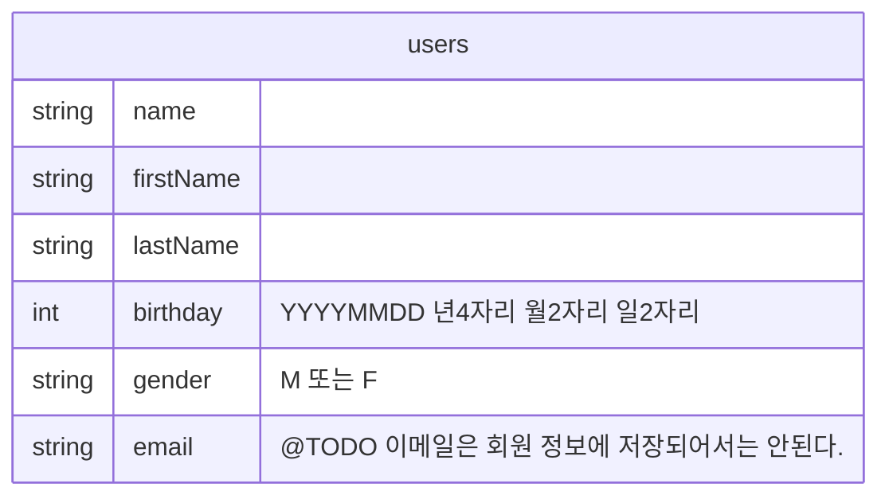

# FireFlutter v0.3

[English version](README.en.md)


# 개요

- 생산적이지 못하고 성공적이지 못한 결과를 만들어 내는 이유는 오직 하나, 코드를 복잡하 작성하기 때문이다. 반드시, 가장 간단한 코드로 작성되어야 하며 그렇지 않으면 실패하는 것으로 간주한다.
- 파이어베이스 데이터베이스는 NoSQL, Flat Style 구조를 가진다.
  - 그래서, Entity Relationship 을 최소화한다.

# 데이터베이스





# 코딩 가이드


- `User` 클래스는 사용자 정보를 관리한다.
- `Post` 클래스는 글 정보를 관리한다.
- `Comment` 클래스는 코멘트 정보를 관리한다.

# Fireflutter 연동

- Fireflutter 를 앱에 연동하기 위해서는 루트 위젯에 `FireFlutter.service.init()` 을 실행한다.

예제)
```dart
class WonderfulKorea extends StatelessWidget {
  const WonderfulKorea({super.key});

  @override
  Widget build(BuildContext context) {
    FireFlutter.instance.init();
    // ...
```

# 사용자 로그인


- 사용자가 로그인을 하지 않은 경우(또는 로그아웃을 한 경우), 자동으로 `Anonymous` 로 로그인을 한다.
- 사용자가 로그인을 하는 경우, 또는 로그인이 되어져 있는 경우, 사용자 문서를 미리 읽어 (두번 읽지 않고) 재 활용을 해 왔는데, 심플한 코드를 위해서 미리 읽지 않는다.
  - 사용자의 정보 표현이 필요한 곳에서는 `MyDoc` 위젯을 사용한다.
  - 만약, (문서 읽기 회 수를 줄이기 위해) 사용자 문서를 미리 읽어 재 활용하고자 한다면, 클라이언트 앱에서 한다.

# 사진(파일) 업로드

- 사용자가 업로드하는 사진은 Storage 의 `/users/<uid>` 에 저장된다.
  - 시간이 지날 수록 사진 업로드의 수가 많아져 하나의 폴더에 모두 넣으면 관리가 어려워 진다.

- Storage 권한은 아래와 같이 지정한다.

```text
match /users/{uid} {
  allow read: if true;
  allow write: if uid == request.auth.uid;
}
```

- 사진은 [Resize Images](https://firebase.google.com/products/extensions/firebase-storage-resize-images) 익스텐션을 사용해서 자동 썸네일을 생성한다.
  - 썸네일은 `_320x320.webp` 로 저장되도록 해야 한다.
    - 이렇게 하기 위해서는 설정을 `이미지 저장 경로` 를 `/users` 로 지정하고, 썸네일을 `320x320` 크기로 `webp` 형태로 저장하면 된다.
  - 업로드 한 이미지는 `UploadedImage` 위젯을 통해 보여주면 된다.

- 파일 업로드 예제

```dart
FileUploadButton(
  type: 'user',
  onProgress: (p) => setState(() => this.p = p),
  onUploaded: (url) async {
    await UserService.instance.update({'photoUrl': url});
    setState(() => p = 0);
  }
  child: ...
```

## 업로드된 사진 보여주기


- 사진을 업로드 후, 보열 줄 때에는 `UploadedImage` 를 사용하면 된다. 이 위젯은 썸네일된 이미지가 있으면 보여주고 없으면 원본 이미지를 보여준다.

- `UploadedImage` 예제)

```dart
UploadedImage(
  url: user.photoUrl,
  width: size,
  height: size,
  loader: SizedBox.shrink(),
)
```


- 사용자 프로필을 보여 줄 때 `ProfilePhoto` 위젯을 쓰면 되는데, 이 위젯은 사용자 문서를 입력 받아서 그 사용자의 `photoUrl` 에 있는 프로필 사진을 보여주는 것이다. 내부적으로 `UploadedImage` 를 사용한다.
  - `GestureDector` 나 `MyDoc`, `UserDoc` 등으로 감싸서 활용 할 수 있다.

```dart
MyDoc(
  builder: (my) => ProfilePhoto(
    user: my,
    size: 100,
    emptyIcon: const Icon(
      Icons.person,
      color: Color.fromARGB(255, 111, 111, 111),
      size: 90,
    ),
  ),
),
```