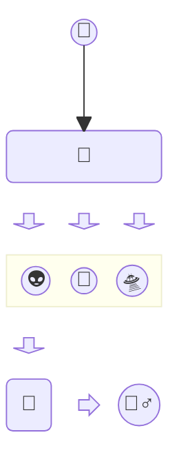

# Fireship

플러터와 Firebase 를 통해서 채팅, 게시판 및 소셜 커뮤니티 앱을 쉽고 빠르게 만들 수 있게 해 주는 Fireship 패키지 설명 문서입니다.

Fireship 을 확장하여 쇼핑몰, CMS 등 다양한 앱을 만들 수 있습니다.

## 설치

- 설치에 대한 설명

## 활용법

[빌딩 블록](building_blocks.md)를 참고하시면, fireship 을 통해서 앱을 개발 할 수 있는 방법에 여러가지 설명을 하고 있습니다.

